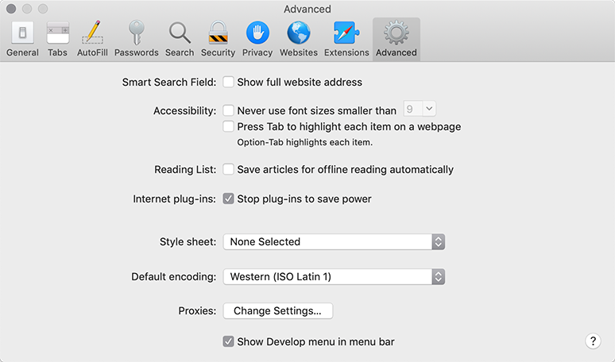

# 開発者コンソール

コードにエラーはつきものです。少なくともあなたが [ロボット](https://en.wikipedia.org/wiki/Bender_(Futurama)) ではなく人間であるなら、*絶対に* 間違いをする、ということです。

しかしブラウザでは、ユーザはデフォルトではエラーは見えません。そのため、スクリプトが上手くいかない場合、何が悪かったのか見ることができず、直すこともできないでしょう。

エラーを確認したりスクリプトに関する多くの役立つ情報を得るために、ブラウザには "開発者ツール" が組み込まれています。

開発者の多くは、開発するのに Chrome か Firefox を利用することが多いです。なぜなら、それらのブラウザは最高の開発者ツールを持っているからです。開発者ツールを提供している他のブラウザも特別な機能を持っていますが、たいてい Chrome かFirefox の "キャッチアップ" です。なので、ほとんどの開発者は "お気に入り" のブラウザを持っており、問題がブラウザ依存の場合は他のブラウザに切り替えます。

開発者ツールは、本当に強力で多くの機能があります。開発を開始するために、私たちはどうやってそれらを開き、エラーを見て、JavaScriptコマンドを実行するのか学びましょう。

## Google Chrome

[bug.html](bug.html)を開きましょう。

このJavaScriptコードにはエラーがあります。通常のサイト訪問者の目からは隠れているので、エラーを確認するために開発者ツールを開きましょう。

`key:F12`もしくは、Macの場合は`key:Cmd+Opt+J`を押します。

開発者ツールが起動します。デフォルトではConsoleタブが開かれているでしょう。

次のようになります:


開発者ツールの正確な見栄えは、利用しているChromeのバージョンに依存します。見栄えが変わることもありますが似ているはずです。

- ここでは赤色でエラーメッセージを見ることができます。このケースでは、スクリプトに未定義の "lalala" コマンドが含まれています。
- 右側にはエラーが発生した行番号とともに、ソース `bug.html：12` へのクリック可能なリンクがあります。

エラーメッセージの下に、青の `>` の記号があります。それは "コマンドライン" を意味し、JavaScriptコマンドを入力し、`key:Enter` を押すことでそれらを実行することができます。

これで私たちはエラーを見ることができるようになったので、開発を開始するには十分です。後ほど開発者ツールに戻り、チャプター <info:debugging-chrome> でより詳細なデバッグをカバーします。

```smart header="複数行の入力"
通常、コンソールに1行コードを入力して `key:Enter` を押すと、コードが実行されます。

複数行を入力したい場合は、`key:Shift+Enter` を押します。この方法で長い  JavaScript コードも入力できます。
```

## Firefox, Edge やその他

ほとんどのブラウザは開発者ツールを開くために `key:F12` を使います。

それらのルック＆フィールはとても似ています。それらの1つ(Chromeで始めるのが良いでしょう)の使い方を知ったら、簡単に別のものに切り替えることができるでしょう。

## Safari

Safari (Mac ブラウザ, Windows/Linux ではサポートされていません)はここでは少しだけ特別です。最初に、 "開発者メニュー" を有効にする必要があります。

Preferencesを開き、"Advanced" ペインに行きます。一番下にチェックボックスがあります。



`key:Cmd+Opt+C`でコンソールを切り替えることができます。また、"開発"という名前の新しいトップメニュー項目が表示されていることにも留意してください。 それは多くのコマンドとオプションを持っています。

## サマリ 

- 開発者ツールは私達がエラーを見たり、コマンドを実行したり、変数を検査したりほかにも多くのことを可能にします。
- Windows下では、ほとんどのブラウザは `key:F12` で開くことができます。Mac用のChromeは `key:Cmd+Opt+J` が必要で、Safariは`key:Cmd+Opt+C`です(最初に有効化が必要)。

これで環境が整いました。次のセクションでは、JavaScriptの説明に入ります。
