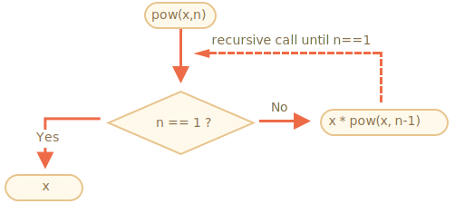
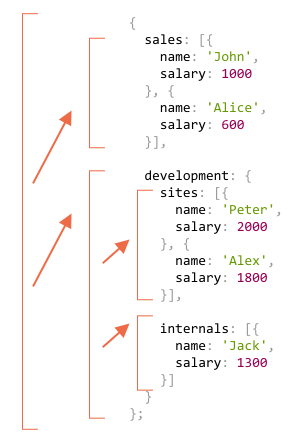

# 再帰とスタック

ここでは関数に戻り、より深く学びましょう。

最初のトピックは *再帰* です。

あなたが初心者のプログラマーでない場合、おそらく知っている内容なのでこのチャプターをスキップしても問題ありません。

再帰は、タスクを同じ種類の複数のタスクに分割することができる状況で役立つプログラミングパターンで、よりシンプルに実現することができます。あるいは、タスクを簡単なアクションと同じタスクのよりシンプルなパターンに単純化できる場合や、この後すぐに見ていきますが特定のデータ構造を扱う場合にも役立ちます。

関数がタスクを解決するとき、処理の過程で多くの他の関数を呼ぶことができます。この部分的なケースとして、関数が *自分自身* を呼ぶときです。それは *再帰* と呼ばれます。

<<<<<<< HEAD
[cut]

## 2つの考え方 
=======
## Two ways of thinking
>>>>>>> cdf382de4cf3ed39ca70cb7df60c4c4886f2d22e

初めのシンプルな例として、`x` の `n` 乗をする関数 `pow(x, n)` を書いてみましょう。つまり、`x` 自身を `n` 回乗算します。

```js
pow(2, 2) = 4
pow(2, 3) = 8
pow(2, 4) = 16
```

2つの実装方法があります。

1. 反復的な考え方: `for` ループ:

    ```js run
    function pow(x, n) {
      let result = 1;

      // ループで、n 回結果を x で乗算する
      for (let i = 0; i < n; i++) {
        result *= x;
      }

      return result;
    }

    alert( pow(2, 3) ); // 8
    ```

2. 再帰的な考え方: タスクの単純化と自身を呼び出す:

    ```js run
    function pow(x, n) {
      if (n == 1) {
        return x;
      } else {
        return x * pow(x, n - 1);
      }
    }

    alert( pow(2, 3) ); // 8
    ```

再帰的な方法が根本的にどう違うのかに注意してください。

`pow(x, n)` が呼ばれたとき、その実行は2つの分岐に分かれます。:


```js
              if n==1  = x
             /
pow(x, n) =
             \       
              else     = x * pow(x, n - 1)
```

1. `n == 1` のときは明白です。これは 再帰の *基底* と呼ばれます。なぜなら、それは即座に明白な結果(今回の場合、`pow(x, 1)` は `x` と等しい)を返すからです。
2. そうでない場合、`pow(x, n)` は `x * pow(x, n - 1)` と表現することができます。数学的には、<code>x<sup>n</sup> = x * x<sup>n-1</sup></code> と書けます。これは *再帰的なステップ* と呼ばれます。タスクをより単純なアクション(`x` の乗算)と、同じタスクの呼び出し(より小さい `n` での `pow`)に変換します。次のステップではそれをさらに単純化し、`n` が `1` になるまで単純化されます。

`pow` は  `n == 1` まで *再帰的に自分自身を呼び出す* 、とも言えます。




例えば、`pow(2, 4)` を計算するために、再帰的なバリアントは次のようなステップを踏みます:

1. `pow(2, 4) = 2 * pow(2, 3)`
2. `pow(2, 3) = 2 * pow(2, 2)`
3. `pow(2, 2) = 2 * pow(2, 1)`
4. `pow(2, 1) = 2`

したがって、再帰は関数呼び出しをより簡単なものに変換し、それを結果が明白になるまで繰り返します。

````smart header="通常、再帰はより短く書けます"
再帰的な解決策は、通常、反復する方法よりも短いです。

<<<<<<< HEAD
ここで、`pow(x, n)` をより簡潔にし、かつ読みやすくするために `if` の代わりに3項演算子 `?` を使って書き直すことができます。:
=======
Here we can rewrite the same using the conditional operator `?` instead of `if` to make `pow(x, n)` more terse and still very readable:
>>>>>>> cdf382de4cf3ed39ca70cb7df60c4c4886f2d22e

```js run
function pow(x, n) {
  return (n == 1) ? x : (x * pow(x, n - 1));
}
```
````

入れ子呼び出しの最大数(最初の1回を含む)は *再帰の深さ*　と呼ばれます。我々のケースでは、それは `n` になります。

<<<<<<< HEAD
最大の再帰の深さは JavaScript エンジンによって制限されています。10,000 は確実で、エンジンによってはより多くの値が可能ですが、100,000 は恐らく大多数の制限を超えます。これを緩和する自動最適もあります("末尾再帰")が、どこでもサポートされているわけではなく、単純なケースでのみ機能します。
=======
The maximal recursion depth is limited by JavaScript engine. We can rely on it being 10000, some engines allow more, but 100000 is probably out of limit for the majority of them. There are automatic optimizations that help alleviate this ("tail calls optimizations"), but they are not yet supported everywhere and work only in simple cases.
>>>>>>> cdf382de4cf3ed39ca70cb7df60c4c4886f2d22e

それは再帰の使用を制限しますが、依然として非常に広範囲に使われています。再帰的な考え方でコードがシンプルになり、保守が容易になるタスクはたくさんあります。

<<<<<<< HEAD
## 実行スタック 
=======
## The execution context and stack
>>>>>>> cdf382de4cf3ed39ca70cb7df60c4c4886f2d22e

さて、どのように再帰呼び出しが動作するか検証してみましょう。そのためには関数の内部を見ていきます。

<<<<<<< HEAD
関数の実行に関する情報は、その *実行コンテキスト* に格納されています。
=======
The information about the process of execution of a running function is stored in its *execution context*.
>>>>>>> cdf382de4cf3ed39ca70cb7df60c4c4886f2d22e

[実行コンテキスト(execution context)](https://tc39.github.io/ecma262/#sec-execution-contexts) は関数の実行に関する詳細を含む内部のデータ構造です。: 今はどの制御フローであるか、現在の変数、`this` の値(ここでは使いませんが)や、その他いくつかの内部データを持ちます。

1つの関数呼び出しには、それに関連付けられた実行コンテキストが1つだけあります。

関数がネスト呼び出しをした場合、次のようなことが起こります:

- 現在の関数が一時停止します。
- 現在の関数に関連付けられている実行コンテキストは、 *実行コンテキストスタック* と呼ばれる特別なデータ構造で記録されます。
- ネスト呼び出しを実行します。
- それが終わると、スタックから古い実行コンテキストが取り出され、停止した所から外部の関数が再開されます。

`pow(2, 3)` が呼ばれたとき、何が起きるのか見てみましょう。

### pow(2, 3)

`pow(2, 3)` の呼び出しの始めでは、実行コンテキストは変数を格納します: `x = 2, n= 3 `。実行フローは関数の `1` 行目です。

我々はそれを次のようにスケッチできます:

<ul class="function-execution-context-list">
  <li>
    <span class="function-execution-context">Context: { x: 2, n: 3, at line 1 }</span>
    <span class="function-execution-context-call">pow(2, 3)</span>
  </li>
</ul>

これは、関数が実行を開始したときです。条件 `n == 1` は false なので、フローは `if` の2つ目の分岐(else)に続きます:

```js run
function pow(x, n) {
  if (n == 1) {
    return x;
  } else {
*!*
    return x * pow(x, n - 1);
*/!*
  }
}

alert( pow(2, 3) );
```

変数は同じですが、行が変わっています。なので、コンテキストは次のようになります:

<ul class="function-execution-context-list">
  <li>
    <span class="function-execution-context">Context: { x: 2, n: 3, at line 5 }</span>
    <span class="function-execution-context-call">pow(2, 3)</span>
  </li>
</ul>

`x * pow(x, n - 1)` を計算するためには、新しい引数 `pow(2, 2)` での `pow` のサブコールを作る必要があります。

### pow(2, 2)

ネストされた呼び出しをするため、JavaScript は *実行コンテキストスタック* に現在の実行コンテキストを記憶します。

ここで、我々は同じ関数 `pow` を呼びますが、まったく問題ありません。処理はすべての関数で同じです:

1. 現在のコンテキストはスタックの先頭に "記憶" されます。
2. サブコールをするための新しいコンテキストが作られます。
3. サブコールが終わったとき、前のコンテキストがスタックから取り出され、実行が再開されます。

サブコール `pow(2, 2)` に入ったときのコンテキストスタックを次に示します:

<ul class="function-execution-context-list">
  <li>
    <span class="function-execution-context">Context: { x: 2, n: 2, at line 1 }</span>
    <span class="function-execution-context-call">pow(2, 2)</span>
  </li>
  <li>
    <span class="function-execution-context">Context: { x: 2, n: 3, at line 5 }</span>
    <span class="function-execution-context-call">pow(2, 3)</span>
  </li>
</ul>

新しい現在の実行コンテキストが上(で太字のもの)で、以前に記憶されたコンテキストが下にあります。

<<<<<<< HEAD
サブコールが終わったとき、以前のコンテキストを再開するのは簡単です。なぜなら、変数と停止したコードの正確な位置を両方とも維持しているためです。この絵の中では、"行(line)" という言葉を使いましたが、もちろん実際それはより精密です。
=======
When we finish the subcall -- it is easy to resume the previous context, because it keeps both variables and the exact place of the code where it stopped.

```smart
Here in the picture we use the word "line", as our example there's only one subcall in line, but generally a single line of code may contain multiple subcalls, like `pow(…) + pow(…) + somethingElse(…)`.

So it would be more precise to say that the execution resumes "immediately after the subcall".
```
>>>>>>> cdf382de4cf3ed39ca70cb7df60c4c4886f2d22e

### pow(2, 1)

処理の繰り返し: 新しいサブコールが `5` 行目で作られ、今は `x=2`, `n=1` という引数です。

新しい実行コンテキストが作られ、前のものはスタックの先頭にプッシュされます。:

<ul class="function-execution-context-list">
  <li>
    <span class="function-execution-context">Context: { x: 2, n: 1, at line 1 }</span>
    <span class="function-execution-context-call">pow(2, 1)</span>
  </li>
  <li>
    <span class="function-execution-context">Context: { x: 2, n: 2, at line 5 }</span>
    <span class="function-execution-context-call">pow(2, 2)</span>
  </li>
  <li>
    <span class="function-execution-context">Context: { x: 2, n: 3, at line 5 }</span>
    <span class="function-execution-context-call">pow(2, 3)</span>
  </li>
</ul>

2つの古いコンテキストと、現在 `pow(2, 1)` を実行中の1つのコンテキストがあります。

### The exit

`pow(2, 1)` の実行は、これまでとは異なり条件 `n == 1` が真になります。従って `if` の最初の分岐に入ります:

```js
function pow(x, n) {
  if (n == 1) {
*!*
    return x;
*/!*
  } else {
    return x * pow(x, n - 1);
  }
}
```

それ以上ネストされた呼び出しはないので、関数は `2` を返して終わりです。

関数が終了したので、その実行コンテキストは不要となり、メモリから削除されます。そして、以前のコンテキストがスタックの先頭から復元されます。:


<ul class="function-execution-context-list">
  <li>
    <span class="function-execution-context">Context: { x: 2, n: 2, at line 5 }</span>
    <span class="function-execution-context-call">pow(2, 2)</span>
  </li>
  <li>
    <span class="function-execution-context">Context: { x: 2, n: 3, at line 5 }</span>
    <span class="function-execution-context-call">pow(2, 3)</span>
  </li>
</ul>

`pow(2, 2)` の実行が再開されます。これはサブコール `pow(2, 1)` の結果を持っているので、同様に`x * pow(x, n - 1)` の評価を完了することができ、`4` を返します。

続いて、その前のコンテキストが復元されます:

<ul class="function-execution-context-list">
  <li>
    <span class="function-execution-context">Context: { x: 2, n: 3, at line 5 }</span>
    <span class="function-execution-context-call">pow(2, 3)</span>
  </li>
</ul>

これが終了したとき、`pow(2, 3) = 8` の結果を得ます。

このケースでの再帰の深さは **3** です。

上の図から分かるように、再帰の深さはスタックのコンテキストの最大数と等しくなります。

メモリ要件に注意してください。コンテキストはメモリを必要とします。今回のケースでは、`n` のべき乗を行うためには、`n` より小さいすべての値に対して、コンテキストのためのメモリが必要です。

一方、ループベースのアルゴリズムはメモリを節約します:

```js
function pow(x, n) {
  let result = 1;

  for (let i = 0; i < n; i++) {
    result *= x;
  }

  return result;
}
```

反復的な `pow` は処理の中で、 `i` と `result` が変化する1つのコンテキストを使います。そのメモリ要件は小さく、固定で `n` に依存しません。

**どんな再帰もループで書き直すことができます。通常、ループのバリアントは、より効率的にすることができます。**

...しかし、関数が条件によって異なる再帰サブコールを使用してその結果をマージするときや、分岐がより複雑な場合には書き直しは簡単ではないことがあります。また、最適化は不要であり、努力に値しないものである可能性があります。

再帰はより短いコードで書くことを可能とし、理解や保守をし易くします。 最適化はあらゆる場所で必要とされるわけではなく、大半は良いコードが必要です。そのために再帰は使用されています。

## 再帰的な横断 

再帰のもう１つの優れた用途は、再帰的な探索です。

私たちは会社を持っていると想像してください。 スタッフの構造はオブジェクトで示すことができます:

```js
let company = {
  sales: [{
    name: 'John',
    salary: 1000
  }, {
    name: 'Alice',
    salary: 1600
  }],

  development: {
    sites: [{
      name: 'Peter',
      salary: 2000
    }, {
      name: 'Alex',
      salary: 1800
    }],

    internals: [{
      name: 'Jack',
      salary: 1300
    }]
  }
};
```

<<<<<<< HEAD
言い換えると、会社は部署を持っています。
=======
In other words, a company has departments.

- A department may have an array of staff. For instance, `sales` department has 2 employees: John and Alice.
- Or a department may split into subdepartments, like `development` has two branches: `sites` and `internals`. Each of them has their own staff.
- It is also possible that when a subdepartment grows, it divides into subsubdepartments (or teams).
>>>>>>> cdf382de4cf3ed39ca70cb7df60c4c4886f2d22e

- 部署はスタッフの配列を持っているかもしれません。例えば、`sales` 部門は２人の従業員がいます。John と Alice です。
- もしくは、`development` は２つの枝(`sites` と `internals`)を持っているように、部署はサブの部署に分割されるかもしれません。それらは各々のスタッフを持ちます。
- サブの部署が成長したとき、サブのさらにサブ部署 (またはチーム) に分割される可能性もあります。

    例えば、将来 `sites` 部門が `siteA` と `siteB` のチームに分割されるかもしれません。そしてそれらは潜在的にさらに分割することができます。

<<<<<<< HEAD
では、全員の給料の合計を取得する関数が欲しいとしましょう。どのようにすればよいでしょう？
=======
An iterative approach is not easy, because the structure is not simple. The first idea may be to make a `for` loop over `company` with nested subloop over 1st level departments. But then we need more nested subloops to iterate over the staff in 2nd level departments like `sites`... And then another subloop inside those for 3rd level departments that might appear in the future? If we put 3-4 nested subloops in the code to traverse a single object, it becomes rather ugly.
>>>>>>> cdf382de4cf3ed39ca70cb7df60c4c4886f2d22e

反復的なアプローチは簡単ではありません。なぜなら構造はシンプルではないためです。最初のアイデアは、第1レベルの所属のネストされたサブループをもつ `company` に `for` をループを作ることです。しかし、次に `sites` のような 第2レベルの部門のスタッフを反復するためには、より多くのネストされたサブループが必要になります。...そして、将来現れるかもしれない第３レベルの部門のための別のサブループも必要ですか？またレベル3で停止するか、レベル4のループも作成する必要がありますか？ 1つのオブジェクトを探索するために3〜4個のネストされたサブループをコード内に置くと、それはかなり醜いものになります。

再帰でトライしてみましょう。

<<<<<<< HEAD
上から分かるように、関数が合計するための部署を取得するとき、2つのケースがあります:

1. *人の配列* を持つ "シンプルな" 部署の場合です。この場合は単純なループで給料を合計することができます。
2. もしくは *`N` 個のサブ部門を持つオブジェクト* の場合です。この場合は、`N` 回の再帰呼び出しを行ってサブ部門の各合計を取得し、結果を結合します。

(1) は再帰の基底で、自明なケースです。
=======
1. Either it's a "simple" department with an *array* of people -- then we can sum the salaries in a simple loop.
2. Or it's *an object* with `N` subdepartments -- then we can make `N` recursive calls to get the sum for each of the subdeps and combine the results.

The 1st case is the base of recursion, the trivial case, when we get an array.

The 2nd case when we get an object is the recursive step. A complex task is split into subtasks for smaller departments. They may in turn split again, but sooner or later the split will finish at (1).
>>>>>>> cdf382de4cf3ed39ca70cb7df60c4c4886f2d22e

(2) は再帰ステップです。複雑なタスクはより小さい部門のためのサブタスクに分割されます。それらは次々に繰り返し分割するかもしれませんが、遅かれ早かれ分割は (1) で終わります。

このアルゴリズムは恐らくコードからさらに読みやすくなるでしょう:

```js run
<<<<<<< HEAD
let company = { // 同じオブジェクトです。簡略のため圧縮しています
  sales: [{name: 'John', salary: 1000}, {name: 'Alice', salary: 600 }],
=======
let company = { // the same object, compressed for brevity
  sales: [{name: 'John', salary: 1000}, {name: 'Alice', salary: 1600 }],
>>>>>>> cdf382de4cf3ed39ca70cb7df60c4c4886f2d22e
  development: {
    sites: [{name: 'Peter', salary: 2000}, {name: 'Alex', salary: 1800 }],
    internals: [{name: 'Jack', salary: 1300}]
  }
};

// ジョブを行う関数
*!*
function sumSalaries(department) {
  if (Array.isArray(department)) { // case (1)
    return department.reduce((prev, current) => prev + current.salary, 0); // 配列の合計
  } else { // case (2)
    let sum = 0;
    for (let subdep of Object.values(department)) {
      sum += sumSalaries(subdep); // サブ部署への再帰呼び出し、結果を合計する
    }
    return sum;
  }
}
*/!*

alert(sumSalaries(company)); // 7700
```

コードは(望んだように?)短く理解しやすくなりました。これが再帰の力です。また、これは任意のレベルのサブ部門のネスティングでも正しく動作します。

呼び出しの図式は次の通りです:



我々はその原理が容易に理解できます: オブジェクト `{...}` に対してはサブコールが作られ、配列 `[...]` は再帰ツリーの "葉" であり即座に結果を返します。

このコードでは、以前学んだスマートな機能を使っていることに留意してください:

- 配列の合計を取得するために、チャプター <info:array-methods> で説明したメソッド `arr.reduce` を使用しています。
- オブジェクトの値を反復するためにループ`for(val of Object.values(obj))` を使用しています: `Object.values` は値の配列を返します。

## 再帰構造 

再帰(再帰的に定義された)データ構造は、それ自身を部分的に複製する構造です。

私たちは、上の会社構造の例でちょうどそれを見ました。

会社の *部署* は:
- 人の配列
- もしくは *部署* を持つオブジェクト

のどちらかです。

web開発者にとっては、もっとよく知られている例があります: HTMLやXMLドキュメントです。

HTMLドキュメントでは、*HTMLタグ* には次の一覧が含まれています:
- テキスト部分
- HTML コメント
- 他の *HTMLタグ* (これにはテキスト部分/コメントや他のタグなどが含まれています)

これは繰り返しになりますが、再帰的な定義です。

より深い理解のために、 もう1つ、いくつかのケースでは配列の代わりのより良い選択肢かもしれない "連結リスト" と呼ばれる再帰構造を学びましょう。

### 連結リスト(Linked list)

想像してください、我々が順序付けされたオブジェクトのリストを保存したいとします。

自然な選択肢は配列です:

```js
let arr = [obj1, obj2, obj3];
```

...しかし、配列を使う場合には問題があります。 "要素の削除" と "要素の挿入" 操作はコストが高いです。例えば `arr.unshift(obj)` 操作は新しい `obj` のための場所を作るために、全ての要素の番号を振り直す必要があります。また、もし配列が大きい場合、それは時間がかかります。`arr.shift()` も同じです。

<<<<<<< HEAD
大量の番号の再割当てを必要としない唯一の構造変更は配列の末尾への操作です: `arr.push/pop`。従って、配列は大きなキューに対しては非常に遅くなる可能性があります。
=======
The only structural modifications that do not require mass-renumbering are those that operate with the end of array: `arr.push/pop`. So an array can be quite slow for big queues, when we have to work with the beginning.
>>>>>>> cdf382de4cf3ed39ca70cb7df60c4c4886f2d22e

あるいは、もしも本当に速い挿入/削除が必要であれば、[連結リスト(linked list)](https://en.wikipedia.org/wiki/Linked_list) と呼ばれる別のデータ構造を選択することもできます。

*連結リスト要素* は次の要素をもつオブジェクトとして、再帰的に定義されます:
- `value`.
- 次の *連結リスト要素* または末尾の場合は `null` を参照する `next` プロパティ。

例:

```js
let list = {
  value: 1,
  next: {
    value: 2,
    next: {
      value: 3,
      next: {
        value: 4,
        next: null
      }
    }
  }
};
```

リストの図式表示です:


以下は作成するための代替のコードです:

```js no-beautify
let list = { value: 1 };
list.next = { value: 2 };
list.next.next = { value: 3 };
list.next.next.next = { value: 4 };
list.next.next.next.next = null;
```

<<<<<<< HEAD
ここでは複数のオブジェクトがあり、それぞれが `value` と隣を指し示す `next` を持っていることがはっきり見えます。`list` 変数はチェーンの最初なので、`next` ポインタの後にはどの要素にも到達することができます。
=======
Here we can even more clearly see that there are multiple objects, each one has the `value` and `next` pointing to the neighbour. The `list` variable is the first object in the chain, so following `next` pointers from it we can reach any element.
>>>>>>> cdf382de4cf3ed39ca70cb7df60c4c4886f2d22e

リストは簡単に複数の部分に分割したり、後で戻したりできます:

```js
let secondList = list.next.next;
list.next.next = null;
```


次の方法で結合できます:

```js
list.next.next = secondList;
```

そして、もちろんどんな場所にもアイテムを挿入したり取り除いたりすることができます。

例えば、新しい値を先頭に追加するには、リストの先頭を更新します。:

```js
let list = { value: 1 };
list.next = { value: 2 };
list.next.next = { value: 3 };
list.next.next.next = { value: 4 };

*!*
// 新しい値をリストの前に追加する
list = { value: "new item", next: list };
*/!*
```


間から値を取り除くには、その前の `next` を変更します:

```js
list.next = list.next.next;
```


`list.next` は `1` を飛び越えて `2` という値になりました。値 `1` は今やチェーンからは除外されています。もしもそれがどこにも保持されていない場合、自動的にメモリから削除されます。

配列とは違って、大量の番号の再割り当てはなく、要素を簡単に組み替えることができます。

当然ながら、リストは常に配列よりも優れているとは限りません。そうでなければ皆リストだけを使うでしょう。

主な欠点は、番号では簡単に要素にアクセスできないことです。配列では簡単です( `arr[n]` で直接参照します)が、リストではアイテムの最初から始めてN個目の要素を取得するために、`N` 回 `next` を行う必要があります。

<<<<<<< HEAD
...でも、常にこのような操作が必要とは限りません。例えば、キュー(queue)や [デック(deque)](https://en.wikipedia.org/wiki/Double-ended_queue) が必要なときです。これらは両端から要素を非常に高速に追加/削除できる順序付けられた構造です。

時には、リストの最後の要素を追跡するために `tail` という名前の別の変数を追加する価値があります(そして要素を最後に追加または削除するときにそれを更新します)。要素の集合が大きいと、配列と速度の違いが大きくなります。
=======
...But we don't always need such operations. For instance, when we need a queue or even a [deque](https://en.wikipedia.org/wiki/Double-ended_queue) -- the ordered structure that must allow very fast adding/removing elements from both ends, but access to its middle is not needed.

Lists can be enhanced:
- We can add property `prev` in addition to `next` to reference the previous element, to move back easily.
- We can also add a variable named `tail` referencing the last element of the list (and update it when adding/removing elements from the end).
- ...The data structure may vary according to our needs.
>>>>>>> cdf382de4cf3ed39ca70cb7df60c4c4886f2d22e

## サマリ 

<<<<<<< HEAD
用語:
- *再帰* は "自己呼び出し" 関数を意味するプログラミングの用語です。このような関数を使用して、特定のタスクを簡潔で美しい方法で解決することができます。
=======
Terms:
- *Recursion*  is a programming term that means calling a function from itself. Recursive functions can be used to solve tasks in elegant ways.
>>>>>>> cdf382de4cf3ed39ca70cb7df60c4c4886f2d22e

    関数が自身を呼び出すとき、それは *再帰ステップ* と呼ばれます。 再帰の *基底* は、関数がそれ以上の呼び出しを行わないようにタスクを単純化する関数の引数です。

- [再帰的な定義(recursively-defined)](https://en.wikipedia.org/wiki/Recursive_data_type) データ構造は自身を使って定義できるデータ構造です。

    例えば、連結リスト(linked list) はリスト(または null)を参照するオブジェクトで構成されているデータ構造として定義できます。

    ```js
    list = { value, next -> list }
    ```

    このチャプターにあったHTML要素や部署のようなツリーもまた、もちろん再帰的です: それらは分岐し、各分岐は別の分岐をもつことができます。

    `sumSalary` の例で見たように、再帰関数を使ってそれらを見て回ることができます。

どんな再帰関数も反復的なものに書き直すことができます。そして、時には最適化を行う必要があります。しかし、多くのタスクでは、再帰的な解決策は十分速く、書きやすく、保守が簡単です。
