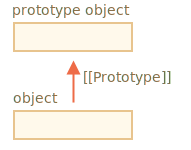
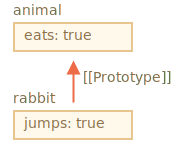
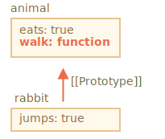
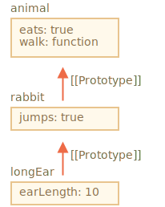
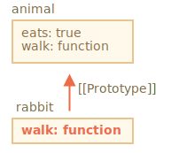
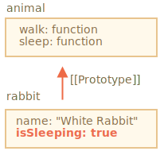

# プロトタイプ継承

プログラミングでは、何かを取ってそれを拡張することがしばしばあります。

例えば、プロパティとメソッドをもつ `user` オブジェクトを持っているとします。そして、そのいくつかを僅かに変更した `admin` や `guest` を作りたいとします。コピーや再実装ではなく、単にその上に新しいオブジェクトを作成することで、`user` が持っているものを再利用したいです。

*プロトタイプ継承* はそれを助ける言語の機能です。

[cut]

## プロトタイプ [[Prototype]]

JavaScriptでは、オブジェクトは特別な隠しプロパティ `[[Prototype]]` を持っており、それは `null` または別のオブジェクトを参照します。そのオブジェクトは "プロトタイプ" と呼ばれます。



`[[Prototype]]` は "魔法のような" 意味を持っています。私たちが `object` からプロパティを読みたいときで、それがない場合、JavaScriptは自動的に、プロトタイプからそれを取得します。プログラミングではこのようなことを "プロトタイプ継承" と呼びます。多くのクールな言語機能やプログラミングテクニックは、これがベースになっています。

プロパティ `[[Prototype]]` は内部であり隠されていますが、セットする多くの方法があります。

それらの１つは、次のように `__proto__` を使う方法です:

```js run
let animal = {
  eats: true
};
let rabbit = {
  jumps: true
};

*!*
rabbit.__proto__ = animal;
*/!*
```

`__proto__` は `[[Prototype]]` と *同一ではない* ことに注意してください。これはそのための getter/setter です。あとでセットする別の方法について話しますが、今のところ `__proto__` の理解はそれで問題ありません。

もしも `rabbit` の中のプロパティを探し、それがない場合、JavaScriptは自動で `animal` からそれを取ります。

例:

```js run
let animal = {
  eats: true
};
let rabbit = {
  jumps: true
};

*!*
rabbit.__proto__ = animal; // (*)
*/!*

// 今、rabbit で両方のプロパティを見つけることができます:
*!*
alert( rabbit.eats ); // true (**)
*/!*
alert( rabbit.jumps ); // true
```

ここで、行 `(*)` は `rabbit` のプロトタイプに `animal` をセットしています。

次に、`alert` がプロパティ `rabbit.eats` `(**)` を読もうとしたとき、それは `rabbit` にはないので、JavaScriptは `[[Prototype]]` 参照に従って、`animal` の中でそれを見つけます(下から上に向かいます)。



ここでは、私たちは "`animal` は `rabbit` のプロトタイプ" または "`rabbit` がプロトタイプ的に `animal` を継承している" という事ができます。"

したがって、もし `animal` が多くの役立つプロパティやメソッドを持っている場合、それらは自動的に `rabbit` でも利用可能になります。
このようなプロパティは "継承" と呼ばれます。

もし `animal` がメソッドを持っている場合、`rabbit` でもそれを呼ぶことができます:

```js run
let animal = {
  eats: true,
*!*
  walk() {
    alert("Animal walk");
  }
*/!*
};

let rabbit = {
  jumps: true,
  __proto__: animal
};

// walk は prototype から取られました
*!*
rabbit.walk(); // Animal walk
*/!*
```

メソッドは次のように自動的にプロトタイプから取られます。:



プロトタイプチェーンは長くても問題ありません。:


```js run
let animal = {
  eats: true,
  walk() {
    alert("Animal walk");
  }
};

let rabbit = {
  jumps: true,
  __proto__: animal
};

let longEar = {
  earLength: 10,
  __proto__: rabbit
}

// walk は prototype チェーンから取られました
longEar.walk(); // Animal walk
alert(longEar.jumps); // true (rabbit から)
```



実際には、2つの制限があります。:

1. 参照を循環させることはできません。JavaScriptは、循環するように `__proto__` を割り当てようとするとエラーを投げます。
2. `__proto__` の値はオブジェクトまたは `null` になります。プリミティブのような、それ以外のすべての値は無視されます。

また、それは明らかかもしれませんが、1つの `[[Prototype]]` しか存在しません。 オブジェクトは2つの他のものから継承することはできません。

## 読み書きのルール 

プロトタイプは、プロパティを読むためだけに使われます。

データプロパティ(getter/setter ではない)の場合、書き込み/削除操作はオブジェクトで直接動作します。

下の例では、自身の `walk` メソッドを `rabbit` に割り当てています。:

```js run
let animal = {
  eats: true,
  walk() {
    /* このメソッドは rabbit では使われません */  
  }
};

let rabbit = {
  __proto__: animal
}

*!*
rabbit.walk = function() {
  alert("Rabbit! Bounce-bounce!");
};
*/!*

rabbit.walk(); // Rabbit! Bounce-bounce!
```

これ以降、`rabbit.walk()` 呼び出しは、プロトタイプを使うことなく、オブジェクトの中にすぐにメソッドを見つけ、それを実行します。



getter/setter の場合 -- もしプロパティの読み書きをすると、プロトタイプで参照されて呼び出されます。

例えば、以下のコードで `admin.fullName` プロパティをチェックしてください:

```js run
let user = {
  name: "John",
  surname: "Smith",

  set fullName(value) {
    [this.name, this.surname] = value.split(" ");
  },

  get fullName() {
    return `${this.name} ${this.surname}`;
  }
};

let admin = {
  __proto__: user,
  isAdmin: true
};

alert(admin.fullName); // John Smith (*)

// setter がトリガします!
admin.fullName = "Alice Cooper"; // (**)
```

ここで、行 `(*)` では、プロパティ `admin.fullName` はプロトタイプ `user` が getter を持っているので、それが呼ばれます。また、行 `(**)` では、プロパティはプロトタイプに setter を持っているので、それが呼ばれます。

## "this" の値 

上の例で、興味深い質問が起きるかもしれません。: `set fullName(value)` の内側での `this` の値はなんでしょうか？
プロパティ `this.name` と `this.surname` が書かれているのはどこでしょうか？ `user` または `admin` ?

答えはシンプルです: `this` はプロトタイプによる影響を持ったく受けません。

**メソッドがどこにあるかは関係ありません：オブジェクトの中でも、そのプロトタイプ内でも。メソッド呼び出しでは、`this` は常にドットの前のオブジェクトです。**

したがって、setter は実際に `this` として `admin` を使い、`user` ではありません。

それは、実際には非常に重要なことです。なぜなら、多くのメソッドを持つ大きなオブジェクトを持ち、それを継承する可能性があるからです。次に、継承されたオブジェクトの上でそれらのメソッドを実行し、大きなオブジェクトではなく、継承したオブジェクトの状態を変更します。

例えば、ここでは `animal` は "メソッド格納域" を表現しており、`rabbit` はそれを使います。

呼び出し `rabbit.sleep()` は `rabbit` オブジェクトに `this.isSleeping` をセットします。:

```js run
// animal がメソッドを持っています
let animal = {
  walk() {
    if (!this.isSleeping) {
      alert(`I walk`);
    }
  },
  sleep() {
    this.isSleeping = true;
  }
};

let rabbit = {
  name: "White Rabbit",
  __proto__: animal
};

// rabbit.isSleeping を変更する
rabbit.sleep();

alert(rabbit.isSleeping); // true
alert(animal.isSleeping); // undefined (prototype にそのようなプロパティはありません)
```

結果の図は次のようになります:



もしも私たちが `bird`, `snake` など `animal` から継承された他のオブジェクトを持っていた場合、それらもまた `animal` のメソッドへのアクセスを得ます。しかし各メソッドでの `this` は対応するオブジェクトであり、`animal` ではなく、呼び出し時に（前のドット）で評価されます。 だから私たちが `this` にデータを書き込むとき、それはこれらのオブジェクトに格納されます。

結果として、メソッドは共有されますが、オブジェクトの状態は共有されません。

## サマリ 

- JavaScriptでは、すべてのオブジェクトは隠れた `[[Prototype]]` プロパティを持っており、それは別のオブジェクトまたは `null` です。
- それにアクセスするために `obj.__proto__` を使うことができます(他の方法もあります。それらは後ほど学びます)。
- `[[Prototype]]` によるオブジェクトの参照は "プロトタイプ" と呼ばれます。
- もしも `obj` のプロパティを読みたい、またはメソッドを呼び出したいが存在しない場合、JavaScriptはそれをプロトタイプの中で見つけようとします。書き込み/削除操作はオブジェクトに対して直接動作し、プロトタイプを使いません(プロパティが setter でない限り)。
- もしも `obj.method()` を呼び出し、`method` がプロトタイプから取られた場合も、`this` は依然として `obj` を参照します。したがって、メソッドはたとえ継承されていたとしても、常に現在のオブジェクトで動作します。
