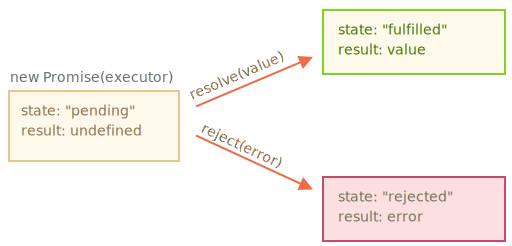

# Promise

あなたはトップシンガーで、ファンは今後のシングルについて絶えず尋ねていると想像してください。

それに関して解放されるため、あなたは公開時にその曲を送ることを約束します。 また、ファンに更新を購読できるリストを提供します。彼らはメールアドレスを記入することができ、曲が利用可能になるとすべての購読者がすぐに受け取れるようになります。 
そして、万が一何か手違いがありその曲を発表する計画が取り消されたとしても、彼らはその通知を受けとることができるでしょう。

みんな幸せです: ファンはこれ以上あなたの元へ押し寄せることはしません。また、ファンはその歌を見逃すことはありません。

これはプログラミングにおいてしばしば抱くことに対する現実的なアナロジーです。:

1. 何かを行い時間を必要とする "生成コード"。例えば、コードはリモートスクリプトをロードします。それは "シンガー" です。
2. 準備が整ったらすぐ "生成コード" の結果が欲しい "消費コード"。多くの関数がその結果を必要とするかもしれません。それらは "ファン" です。
3. *promise* は "生成コード" と "消費コード" をリンクする特別な JavaScript オブジェクトです。今回のアナロジーではそれは "購読リスト" です。生成コードは約束された結果を生成するために必要な時間をとります。そして "promise" は準備ができたら、購読したすべてのコードが結果を利用できるようにします。

JavaScript の promise には追加の特徴や制限があり、単純な購読リストよりも複雑であるため、このアナロジーはあまり正確ではないかもしれません。しかし、最初に理解には良いです。

promise オブジェクトのコンストラクタ構文は次の通りです:

```js
let promise = new Promise(function(resolve, reject) {
  // executor (生成コード, "シンガー")
});
```

`new Promise` へ渡される関数は *executor(執行者)* と呼ばれます。promise が作成されると、自動的に呼ばれます。それは最終的に結果と一緒に終了する生成コードを含んでいます。上記のアナロジーの言葉では、executor は "シンガー" です。

生成された `promise` オブジェクトは内部プロパティを持っています:

- `state` -- 最初は "pending(保留中)" であり、その後 "fulfilled(完了)" もしくは "rejected(拒否)" に変更されます。
- `result` -- 任意の値です。初期値は `undefined` です。

executor がジョブを終了した時、次の中のいずれか1つを呼びます:

- `resolve(value)` -- ジョブが正常に終了したことを示します。:
    - `state` を `"fulfilled"` に設定します,
    - `result` を `value` に設定します.
- `reject(error)` -- エラーが発生したことを示します:
    - `state` を `"rejected"` に設定します,
    - `result` を `error` に設定します.



これは、Promise コンストラクタとその "生成コード" (`setTimeout`) を持つ単純なexecutor関数の例です。

```js run
let promise = new Promise(function(resolve, reject) {
  // promise が作られたとき、関数は自動的に実行されます

  // 1秒後、ジョブが "done!" という結果と一緒に完了したことを合図します
  setTimeout(() => *!*resolve("done!")*/!*, 1000);
});
```

上のコードを実行すると2つの事が見えます:

1. executor は自動的かつ即座に呼ばれます(`new Promise` によって)。
2. executor は2つの引数を受け取ります: `resolve` と `reject` です -- これらの関数は JavaScript エンジンから来ており、これらを作る必要はありません。代わりに、executor は準備ができた際にそれらを呼ぶ必要があります。

1秒後、executor は結果を生成するために `resolve("done")` を呼び出します。:


これは、 "ジョブが正常に完了した" 例でした。

そして、次はエラーで executor が promise を拒否する例です。:

```js
let promise = new Promise(function(resolve, reject) {
  // 1秒後、ジョブがエラーで終わったことを合図します
  setTimeout(() => *!*reject(new Error("Whoops!"))*/!*, 1000);
});
```


要約すると、executor はジョブ(通常は時間のかかる何か)を行い、その後、対応する promise オブジェクトの状態を変更するために、`resolve` または `reject` を呼び出します。

解決または拒否されている promise は、 "pending" の promise とは対照的に "settled" と呼ばれます。

````smart header="1つの結果またはエラーのみです"
executor は1つの `resolve` または `reject` だけを呼びだす必要があります。promise の状態の変化は最後のものです。

さらなるすべての `resolve` や `reject` は無視されます:

```js
let promise = new Promise(function(resolve, reject) {
  resolve("done");

  reject(new Error("…")); // 無視されます
  setTimeout(() => resolve("…")); // 無視されます
});
```

この考えは、executor により行われたジョブは1つの結果またはエラーのみを持つということです。

また、1つ以上の引数で `resolve/reject` を呼び出した場合、最初の引数が使われ、以降の引数は無視されます。
````

```smart header="`Error` オブジェクトで reject する"
技術的には、任意の型の引数で `reject` を呼び出すことが可能です(`resolve` のように)。しかし、`reject` (またはそれを継承したもの)では、`Error` オブジェクトを利用することを推奨します。その理由は後ほど明らかになります。
```

````smart header="Resolve/rejectは即時実行可能です"
実際には、通常 executor は非同期で何かを行い、暫く時間が経過した後に `resolve/reject` を呼び出しますが、それは必須ではありません。次のように、すぐに `resolve` や `reject` を呼び出すことが可能です。:

```js
let promise = new Promise(function(resolve, reject) {
  resolve(123); // 即座に結果を返します: 123
});
```

例えば、ジョブの開始後、すでに完了していることが分かったとき等です。技術的には即座に promise を解決することは問題ありません。
````

```smart header="`state` と `result` は内部のプロパティです"
promise オブジェクトのプロパティ `state` と `result` は内部的なものです。我々のコードから直接アクセスすることはできません。代わりに `.then/catch` メソッドを利用します。それらについては下で説明します。
```

## 消費者: .then, .catch, finally

Promise オブジェクトは executor("生成コード" あるいは "シンガー")と消費関数("ファン") の間のリンクとして機能し、結果またはエラーを受け取ります。消費関数はメソッド `.then`, `.catch`,  `.finally` を使って登録(購読)することができます。

### then

最も重要で基本的なものは `.then` です。

構文は次の通りです:

```js
promise.then(
  function(result) { /* 成功した結果を扱う */ },
  function(error) { /* エラーを扱う */ }
);
```

`.then` の最初の引数は以下の関数です:

1. promise が解決(resolve)されたときに実行され、
2. その結果を受け取ります

`.then` の2つ目の引数は以下の関数です:

1. promise が拒否(reject)されたときに実行され、
2. エラーを受け取ります

例:

```js run
let promise = new Promise(function(resolve, reject) {
  setTimeout(() => resolve("done!"), 1000);
});

// resolve は .then の最初の関数を実行する
promise.then(
*!*
  result => alert(result), // 1秒後に "done!" を表示
*/!*
  error => alert(error) // 実行されない
);
```

最初の関数は実行されました。

そして拒否の場合は2つ目の関数です:

```js run
let promise = new Promise(function(resolve, reject) {
  setTimeout(() => reject(new Error("Whoops!")), 1000);
});

// reject は .then の2つ目の関数を実行する
promise.then(
  result => alert(result), // 実行されない
*!*
  error => alert(error) // 1秒後に "Error: Whoops!" を表示
*/!*
);
```

もし、正常完了の場合だけを扱いたい場合は、`.then` に1つの引数だけを指定することもできます。:

```js run
let promise = new Promise(resolve => {
  setTimeout(() => resolve("done!"), 1000);
});

*!*
promise.then(alert); // 1秒後に "done!" を表示
*/!*
```

### catch

エラーの場合だけに興味がある場合は、第一引数に `null`: `.then(null, function)` が使えます。 または、`.catch(function)` が使えます。これはまったく同じです。


```js run
let promise = new Promise((resolve, reject) => {
  setTimeout(() => reject(new Error("Whoops!")), 1000);
});

*!*
// .catch(f) は promise.then(null, f) と同じです
promise.catch(alert); // 1秒後に "Error: Whoops!" を表示
*/!*
```

`.catch(f)` の呼び出しは、`.then(null, f)` の完全な類似物であり、単に簡略化したものです。

### finally

通常の `try {...} catch {...}` に `finally` 節があるように、Promise にも ` finally` があります。

`.finally(f)` 呼び出しは、Promise が決着したとき(解決または拒否になったとき)に必ず実行されるという意味で `.then(f, f)` に似ています。

`finally` はクリーンアップを実行するのに便利なハンドラです。例えば、結果がどちらであっても、もう不要となったので読み込み中のインジケータを停止するなどです。

このようになります:

```js
new Promise((resolve, reject) => {
  /* 時間のかかる処理を行い、その後 resolve/reject を呼び出す */
})
*!*
  // 成功か失敗かは関係なく、promise が確定したときに実行されます
  .finally(() => 読込中のインジケータを停止する )
*/!*
  .then(result => 結果を表示する, err => エラーを表示する)
```

これは正確な `then(f,f)` のエイリアスではありません。いくつかの重要な違いがあります:

1. `finally` ハンドラは引数を取りません。`finally` では promise が成功したかどうかは分かりません。ただし、ここで行うタスクは、通常 "一般的な" ファイナライズ処理を行うことになるので問題ありません。
2. `finally` ハンドラは次のハンドラに結果あるいはエラーを渡します。

    例えば、ここでは結果が `finally` から `then` へと渡されています:
    ```js run
    new Promise((resolve, reject) => {
      setTimeout(() => resolve("result"), 2000)
    })
      .finally(() => alert("Promise ready"))
      .then(result => alert(result)); // <-- .then は結果(result)を扱います
    ```

    そして、ここでは promise でエラーで発生し、`finally` から `catch` へエラーが渡されています:

    ```js run
    new Promise((resolve, reject) => {
      throw new Error("error");
    })
      .finally(() => alert("Promise ready"))
      .catch(err => alert(err));  // <-- .catch はエラーオブジェクトを扱います
    ```  

    `finally` は promise の結果を処理する手段ではないので、これは非常に便利です。

    次のチャプターでは、promise の連鎖とハンドラ間での結果の受け渡しについてより深く説明します。

3. 大事なことを言い忘れていましたが、`finally(f)` は `.then(f, f)` よりも便利な構文です。: 関数 `f` を複製する必要はありません。

````smart header="完了済みの promise の `then` はすぐに実行されます"
promise が pending の場合、`.then/catch` ハンドラは結果を待ちます。そうではなく、promise がすでに settled である場合は直ちに実行されます。:

```js run
// 即座に promise が解決されます
let promise = new Promise(resolve => resolve("done!"));

promise.then(alert); // done! (すぐに表示されます)
```

これは時間がかかることもあればすぐに終わることもあるジョブにとっては便利です。ハンドラは両方の場合に実行されることが保証されています。
````

次に、非同期コードを書くにあたり、promise がどのように役立つか、より実践的な例を見てみましょう。

## 例: loadScript 

以前のチャプターで、スクリプトを読み込むための関数 `loadScript` がありました。

思い出すために、ここにコールバックベースのパターンを示します。:

```js
function loadScript(src, callback) {
  let script = document.createElement('script');
  script.src = src;

  script.onload = () => callback(null, script);
  script.onerror = () => callback(new Error(`Script load error ` + src));

  document.head.append(script);
}
```

promise を使って再実装してみましょう。

新しい関数 `loadScript` はコールバックを必要としません。代わりに、読み込みが完了したときに解決する promise オブジェクトを生成し返します。外部コードは `.then` を使用してそれにハンドラを追加することができます。:

```js run
function loadScript(src) {  
  return new Promise(function(resolve, reject) {
    let script = document.createElement('script');
    script.src = src;

    script.onload = () => resolve(script);
    script.onerror = () => reject(new Error("Script load error: " + src));

    document.head.append(script);
  });
}
```

使用方法:

```js run
let promise = loadScript("https://cdnjs.cloudflare.com/ajax/libs/lodash.js/3.2.0/lodash.js");

promise.then(
  script => alert(`${script.src} is loaded!`),
  error => alert(`Error: ${error.message}`)
);

promise.then(script => alert('One more handler to do something else!'));
```

コールバックベースのパターンと比べると利点がすぐにわかります。:

| Promise | コールバック |
|----------|-----------|
| Promise を使うことで、自然な順序で処理を記述することができます。まず、`loadScript(script)` を実行し、`.then` を使ってその結果をどうするかを書きます。| `loadScript(script, callback)` を呼び出すときには、`callback` 関数が必要です。つまり、`locadScript` が呼ばれる *前に* 結果をどう処理するのかを知っておく必要があります。|
| Promise では `.then` を何度でも呼び出すことができます。毎回、新しい "ファン" を "購読リスト" に追加しています。 これについては次のチャプターで詳しく説明します: [](info：promise-chaining)。| コールバックは1つだけです |

promise はより良いコードフローと柔軟性をもたらします。しかしもっと多くのことがあります。それらについては次のチャプターで見ていきましょう。
