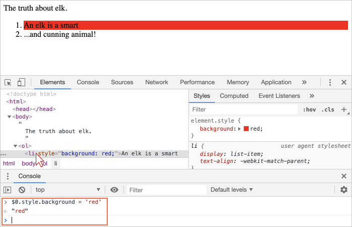
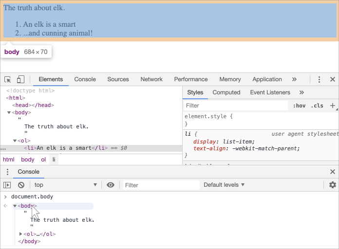

libs:
  - d3
  - domtree

---

# DOM ツリー

HTML文書のバックボーンはタグです。

<<<<<<< HEAD
ドキュメントオブジェクトモデル(DOM)によると、すべてのHTMLタグはオブジェクトです。入れ子のタグはそれを囲タグの "子" と呼ばれます。

タグの内側のテキストも同様にオブジェクトです。

すべてのそれらのオブジェクトは JavaScript でアクセス可能です。

## DOM の例 

例えば、このドキュメントに対する DOM を調べてみましょう:
=======
According to the Document Object Model (DOM), every HTML tag is an object. Nested tags are  "children" of the enclosing one. The text inside a tag is an object as well.

All these objects are accessible using JavaScript, and we can use them to modify the page.

For example, `document.body` is the object representing the `<body>` tag.

Running this code will make the `<body>` red for 3 seconds:

```js run
document.body.style.background = 'red'; // make the background red

setTimeout(() => document.body.style.background = '', 3000); // return back
```

Here we used `style.background` to change the background color of `document.body`, but there are many other properties, such as:

- `innerHTML` -- HTML contents of the node.
- `offsetWidth` -- the node width (in pixels)
- ...and so on.

Soon we'll learn more ways to manipulate the DOM, but first we need to know about its structure.

## An example of the DOM

Let's start with the following simple document:
>>>>>>> a4a84083a7656f2b25de8b766b2457d3aae17874

```html run no-beautify
<!DOCTYPE HTML>
<html>
<head>
  <title>About elk</title>
</head>
<body>
  The truth about elk.
</body>
</html>
```

DOM は HTMLをタグのツリー構造として表現します。それはこのように見えます:

<div class="domtree"></div>

<script>
let node1 = {"name":"HTML","nodeType":1,"children":[{"name":"HEAD","nodeType":1,"children":[{"name":"#text","nodeType":3,"content":"\n    "},{"name":"TITLE","nodeType":1,"children":[{"name":"#text","nodeType":3,"content":"About elk"}]},{"name":"#text","nodeType":3,"content":"\n  "}]},{"name":"#text","nodeType":3,"content":"\n  "},{"name":"BODY","nodeType":1,"children":[{"name":"#text","nodeType":3,"content":"\n  The truth about elk."}]}]}

drawHtmlTree(node1, 'div.domtree', 690, 320);
</script>

```online
上の図では、要素をクリックしその子を開いたり閉じることができます。
```

<<<<<<< HEAD
タグは "要素ノード" (もしくは単に要素) と呼ばれます。入れ子のタグは囲まれたタグの子になります。結果的に、我々は要素のツリーを持ちます: `<html>` はルートで、次に `<head>`, `<body>` はその子などとなります。
=======
Every tree node is an object.

Tags are *element nodes* (or just elements) and form the tree structure: `<html>` is at the root, then `<head>` and `<body>` are its children, etc.
>>>>>>> a4a84083a7656f2b25de8b766b2457d3aae17874

要素内のテキストは *テキストノード* を形成し、 `#text` とラベル付けされます。テキストノードは文字列のみを含みます。それは子を持たず、常にツリーの葉です。

<<<<<<< HEAD
例えば、`<title>` タグはテキスト `"About elks"` を持っています。
=======
For instance, the `<title>` tag has the text `"About elk"`.
>>>>>>> a4a84083a7656f2b25de8b766b2457d3aae17874

テキストノード中の特別な文字に注意してください:

- 改行: `↵` (JavaScript では `\n` として知られています)
- スペース: `␣`

<<<<<<< HEAD
スペースと改行 -- は完全に有効な文字で、それらはテキストノードを形成し、DOMの一部になります。従って、例えば、上の例では `<head>` タグは `<title>` の前にいくつかのスペースを含まれており、そのテキストは `#text` ノードになります(それは改行といくつかのスペースのみが含まれています)。

そこには2つだけ、トップレベルの除外があります:
1. `<head>` の前のスペースと改行は歴史的な理由から無視されます。
2. もし `</body>` の後に何かをおいた場合、HTML仕様はすべてのコンテンツが `<body>` の内側でなければならないため、最後にそれらは自動的に `body` の中に移動されます。従って、`</body>` の後にスペースはないことがあります。

別のケースでは、すべてが正直で -- ドキュメント内にスペース（単に任意の文字のように）があれば、それらはDOMのテキストノードになります。もしそれらを削除すれば、何も存在しません。
=======
Spaces and newlines are totally valid characters, like letters and digits. They form text nodes and become a part of the DOM. So, for instance, in the example above the `<head>` tag contains some spaces before `<title>`, and that text becomes a `#text` node (it contains a newline and some spaces only).

There are only two top-level exclusions:
1. Spaces and newlines before `<head>` are ignored for historical reasons.
2. If we put something after `</body>`, then that is automatically moved inside the `body`, at the end, as the HTML spec requires that all content must be inside `<body>`. So there can't be any spaces after `</body>`.

In other cases everything's straightforward -- if there are spaces (just like any character) in the document, then they become text nodes in the DOM, and if we remove them, then there won't be any.
>>>>>>> a4a84083a7656f2b25de8b766b2457d3aae17874

これはスペースがないテキストノードです:

```html no-beautify
<!DOCTYPE HTML>
<html><head><title>About elk</title></head><body>The truth about elk.</body></html>
```

<div class="domtree"></div>

<script>
let node2 = {"name":"HTML","nodeType":1,"children":[{"name":"HEAD","nodeType":1,"children":[{"name":"TITLE","nodeType":1,"children":[{"name":"#text","nodeType":3,"content":"About elk"}]}]},{"name":"BODY","nodeType":1,"children":[{"name":"#text","nodeType":3,"content":"The truth about elk."}]}]}

drawHtmlTree(node2, 'div.domtree', 690, 210);
</script>

<<<<<<< HEAD
```smart header="端のスペースとその間にある空のテキストは、通常はツール内に隠されています"
DOMを使って動作するブラウザツール（間もなくカバーされる）は、通常、テキストの最初/最後のスペースを表示せず、またタグ間に空のテキストノード（改行）も表示しません。

これは、主にHTMLを装飾するために使用され、どのように表示されるかに（ほとんどの場合）影響を与えないからです。

さらにDOMの図では、物事を短く保つために、それらが無関係な場所で省略することがあります。
```


## 自動補正 

もしブラウザが不正な形式のHTMLに遭遇したとき、ブラウザはDOMを作成時にそれを自動補正します。

例えば、トップタグは常に `<html>` です。たとえドキュメントの中に存在していなくても -- それはDOMの中におり、ブラウザはそれを生成します。`<body>` についても同じです。
=======
```smart header="Spaces at string start/end and space-only text nodes are usually hidden in tools"
Browser tools (to be covered soon) that work with DOM usually do not show spaces at the start/end of the text and empty text nodes (line-breaks) between tags.

Developer tools save screen space this way.

On further DOM pictures we'll sometimes omit them when they are irrelevant. Such spaces usually do not affect how the document is displayed.
```

## Autocorrection

If the browser encounters malformed HTML, it automatically corrects it when making the DOM.

For instance, the top tag is always `<html>`. Even if it doesn't exist in the document, it will exist in the DOM, because the browser will create it. The same goes for `<body>`.

As an example, if the HTML file is the single word `"Hello"`, the browser will wrap it into `<html>` and `<body>`, and add the required `<head>`, and the DOM will be:
>>>>>>> a4a84083a7656f2b25de8b766b2457d3aae17874

例として、もしHTMLファイルが `"Hello"` という言葉のみだった場合、ブラウザはそれを `<html>` と `<body>` でラップし、必須の `<head>` を追加し、DOMは次のようになります:

<div class="domtree"></div>

<script>
let node3 = {"name":"HTML","nodeType":1,"children":[{"name":"HEAD","nodeType":1,"children":[]},{"name":"BODY","nodeType":1,"children":[{"name":"#text","nodeType":3,"content":"Hello"}]}]}

drawHtmlTree(node3, 'div.domtree', 690, 150);
</script>

<<<<<<< HEAD
DOMを生成している間、ブラウザは自動的にドキュメント内のエラーを処理しタグを閉じます。

このような "無効な" ドキュメントの場合:
=======
While generating the DOM, browsers automatically process errors in the document, close tags and so on.

A document with unclosed tags:
>>>>>>> a4a84083a7656f2b25de8b766b2457d3aae17874

```html no-beautify
<p>Hello
<li>Mom
<li>and
<li>Dad
```

<<<<<<< HEAD
...も、ブラウザはタグを読みかけた部分を復元し、通常のDOMになります。:
=======
...will become a normal DOM as the browser reads tags and restores the missing parts:
>>>>>>> a4a84083a7656f2b25de8b766b2457d3aae17874

<div class="domtree"></div>

<script>
let node4 = {"name":"HTML","nodeType":1,"children":[{"name":"HEAD","nodeType":1,"children":[]},{"name":"BODY","nodeType":1,"children":[{"name":"P","nodeType":1,"children":[{"name":"#text","nodeType":3,"content":"Hello"}]},{"name":"LI","nodeType":1,"children":[{"name":"#text","nodeType":3,"content":"Mom"}]},{"name":"LI","nodeType":1,"children":[{"name":"#text","nodeType":3,"content":"and"}]},{"name":"LI","nodeType":1,"children":[{"name":"#text","nodeType":3,"content":"Dad"}]}]}]}

drawHtmlTree(node4, 'div.domtree', 690, 360);
</script>

<<<<<<< HEAD
````warn header="Tables は常に `<tbody>` を持ちます"
興味深い "特別なケース はテーブルです。DOM仕様によると、それらは `<tbody>` をもたなければなりませんが、HTMLテキストでは(公式に)それを省略することができます。そしてブラウザは DOM の中に自動的に `<tbody>` を生成します。
=======
````warn header="Tables always have `<tbody>`"
An interesting "special case" is tables. By the DOM specification they must have `<tbody>`, but HTML text may (officially) omit it. Then the browser creates `<tbody>` in the DOM automatically.
>>>>>>> a4a84083a7656f2b25de8b766b2457d3aae17874

次のHTML:

```html no-beautify
<table id="table"><tr><td>1</td></tr></table>
```

DOM構造は次のようになります:
<div class="domtree"></div>

<script>
let node5 = {"name":"TABLE","nodeType":1,"children":[{"name":"TBODY","nodeType":1,"children":[{"name":"TR","nodeType":1,"children":[{"name":"TD","nodeType":1,"children":[{"name":"#text","nodeType":3,"content":"1"}]}]}]}]};

drawHtmlTree(node5,  'div.domtree', 600, 200);
</script>

<<<<<<< HEAD
分かりますか？ `<tbody>` はどこにも出現していません。このような驚きを避けるためにテーブルを使って作業している間は心に留めておくべきです。
=======
You see? The `<tbody>` appeared out of nowhere. You should keep this in mind while working with tables to avoid surprises.
>>>>>>> a4a84083a7656f2b25de8b766b2457d3aae17874
````

## 他のノードタイプ 

<<<<<<< HEAD
より多くのタグを追加し、ページにコメント追加しましょう:
=======
There are some other node types besides elements and text nodes.

For example, comments:
>>>>>>> a4a84083a7656f2b25de8b766b2457d3aae17874

```html
<!DOCTYPE HTML>
<html>
<body>
  The truth about elk.
  <ol>
    <li>An elk is a smart</li>
*!*
    <!-- comment -->
*/!*
    <li>...and cunning animal!</li>
  </ol>
</body>
</html>
```

<div class="domtree"></div>

<script>
let node6 = {"name":"HTML","nodeType":1,"children":[{"name":"HEAD","nodeType":1,"children":[]},{"name":"BODY","nodeType":1,"children":[{"name":"#text","nodeType":3,"content":"\n  The truth about elk.\n    "},{"name":"OL","nodeType":1,"children":[{"name":"#text","nodeType":3,"content":"\n      "},{"name":"LI","nodeType":1,"children":[{"name":"#text","nodeType":3,"content":"An elk is a smart"}]},{"name":"#text","nodeType":3,"content":"\n      "},{"name":"#comment","nodeType":8,"content":"comment"},{"name":"#text","nodeType":3,"content":"\n      "},{"name":"LI","nodeType":1,"children":[{"name":"#text","nodeType":3,"content":"...and cunning animal!"}]},{"name":"#text","nodeType":3,"content":"\n    "}]},{"name":"#text","nodeType":3,"content":"\n  \n"}]}]};

drawHtmlTree(node6, 'div.domtree', 690, 500);
</script>

<<<<<<< HEAD
ここで、私達は新しいツリーのノードタイプが見えます -- `#comment` とラベル付された *comment node(コメントノード)* です。

私達はこう思うかもしれません -- なぜコメントが DOM に追加されるのでしょう？ それはどのような方法でも視覚的表現には影響しません。 しかし、ルールがあります。HTMLに何かがある場合は、DOMツリーにもなければなりません。

**HTML上のすべて、たとえコメントでも DOM の一部になります。**
=======
We can see here a new tree node type -- *comment node*, labeled as `#comment`, between two text nodes.

We may think -- why is a comment added to the DOM? It doesn't affect the visual representation in any way. But there's a rule -- if something's in HTML, then it also must be in the DOM tree.

**Everything in HTML, even comments, becomes a part of the DOM.**
>>>>>>> a4a84083a7656f2b25de8b766b2457d3aae17874

HTMLの冒頭にある `<!DOCTYPE...>` ディレクティブでさえ DOM ノードです。`<html>`の直前のDOMツリーにあります。 私たちはそのノードに触れるつもりはないし、その理由で図に描画さえしませんが、そこにはあります。

ドキュメント全体を表現する `document` オブジェクトは、正式には DOM ノードでもあります。

[12のノードタイプ](https://dom.spec.whatwg.org/#node)があります。実際には、通常それらのうち4つを使います: 

<<<<<<< HEAD
1. `document` -- DOM に入る "エントリーポイント"
2. 要素ノード -- HTMLタグ, ツリーのビルディングブロック
3. テキストノード -- テキストを含む
4. コメント -- 時々そこに情報をおくことができ、それは表示されません。が JS はDOMからそれを読むことができます。

## あなた自身で見てください 

実際にDOM構造を見るために、[Live DOM Viewer](http://software.hixie.ch/utilities/js/live-dom-viewer/) にトライしてみましょう。ドキュメントに入力するだけで、すぐに DOM が表示されます。

## ブラウザのインスペクタで 

DOM を調べる別の方法はブラウザの開発者ツールを使うことです。実際、開発するときに使っているものです。

それをするために、web ページ [elks.html](elks.html) を開き、ブラウザ開発者ツールを開き、Elements タブに切り替えます。

このようになるはずです:


=======
1. `document` -- the "entry point" into DOM.
2. element nodes -- HTML-tags, the tree building blocks.
3. text nodes -- contain text.
4. comments -- sometimes we can put information there, it won't be shown, but JS can read it from the DOM.

## See it for yourself

To see the DOM structure in real-time, try [Live DOM Viewer](http://software.hixie.ch/utilities/js/live-dom-viewer/). Just type in the document, and it will show up as a DOM at an instant.

Another way to explore the DOM is to use the browser developer tools. Actually, that's what we use when developing.

To do so, open the web page [elk.html](elk.html), turn on the browser developer tools and switch to the Elements tab.

It should look like this:


>>>>>>> a4a84083a7656f2b25de8b766b2457d3aae17874

DOMを見ることができます、要素をクリックしその詳細をみたりすることができます。

<<<<<<< HEAD
開発者ツール上のDOM構造は簡略化されていることに注意してください。テキストノードは単にテキストとして表示されます。また、"空の" (スペースだけの) テキストノードはまったくありません。ほとんどの場合、要素のノードに興味があるのでそれは問題ありません。

左上隅の <span class="devtools" style="background-position:-328px -124px"></span> ボタンをクリックすると、マウス（または他のポインターデバイス）を使用してWebページからノードを選択できます。 それを "検査"します（Elements(要素) タブでスクロールします）。 巨大なHTMLページがあり、その中の特定の場所のDOMを見たいときにうまくいきます。
=======
Please note that the DOM structure in developer tools is simplified. Text nodes are shown just as text. And there are no "blank" (space only) text nodes at all. That's fine, because most of the time we are interested in element nodes.

Clicking the <span class="devtools" style="background-position:-328px -124px"></span> button in the left-upper corner allows us to choose a node from the webpage using a mouse (or other pointer devices) and "inspect" it (scroll to it in the Elements tab). This works great when we have a huge HTML page (and corresponding huge DOM) and would like to see the place of a particular element in it.
>>>>>>> a4a84083a7656f2b25de8b766b2457d3aae17874

それをする別の方法は、web ページ上で単に右クリックをして、コンテキストメニュー上で "Inspect(検査)" を選択することです。


<<<<<<< HEAD
ツールの右側には、次のようなサブのタブがあります:
- Styles - 組み込みルール（灰色）を含めて、ルール別に現在の要素ルールにCSSが適用されていることがわかります。 ほとんどすべては、下のボックスの大きさ/マージン/パディングを含めて編集できます。
- Computed - プロパティによって要素に適用されたCSSを表示する：各プロパティに対して、それを与える規則（CSSの継承などを含む）を見ることができます。
- Event Listeners - DOM要素に関連付けられたイベントリスナーを表示します（チュートリアルの次の部分で説明します）。
- ...など

それらを学ぶベストな方法は、クリックして回ることです。ほとんどの値はその場で変更可能です。
=======
At the right part of the tools there are the following subtabs:
- **Styles** -- we can see CSS applied to the current element rule by rule, including built-in rules (gray). Almost everything can be edited in-place, including the dimensions/margins/paddings of the box below.
- **Computed** -- to see CSS applied to the element by property: for each property we can see a rule that gives it (including CSS inheritance and such).
- **Event Listeners** -- to see event listeners attached to DOM elements (we'll cover them in the next part of the tutorial).
- ...and so on.

The best way to study them is to click around. Most values are editable in-place.
>>>>>>> a4a84083a7656f2b25de8b766b2457d3aae17874

## コンソールとのインタラクション 

<<<<<<< HEAD
DOM を調べるにつれて、それに JavaScript を適用したいことがあります。例えば: ノードを取得し、それを修正するコードを実行して、それがどのように見えるかを確認します。 Elementsタブとコンソールの間を移動するヒントをいくつか紹介します。

- Elements タブで最初の `<li>` を選択します。
- `key:Esc` を押す -- Elements タブのすぐ下にコンソールが開きます。
=======
As we work the DOM, we also may want to apply JavaScript to it. Like: get a node and run some code to modify it, to see the result. Here are few tips to travel between the Elements tab and the console.

For the start:

1. Select the first `<li>` in the Elements tab.
2. Press `key:Esc` -- it will open console right below the Elements tab.
>>>>>>> a4a84083a7656f2b25de8b766b2457d3aae17874

これで、最後に選択した要素は `$0` として利用可能で、以前に選択したものは `$1` です。

我々はそこでコマンドを実行することができます。例えば、`$0.style.background = 'red'` は選択されているリストアイテムを赤にします、このように:



That's how to get a node from Elements in Console.

<<<<<<< HEAD
反対側から、コンソールにいて変数がDOMノードを参照している場合は、`inspect(node)` コマンドを使用してElementsペインに表示することができます。

もしくは単にそれをコンソールに出力し、"その場" で調べることができます。したの `document.body` のように:
=======
There's also a road back. If there's a variable referencing a DOM node, then we can use the command `inspect(node)` in Console to see it in the Elements pane.

Or we can just output the DOM node in the console and explore "in-place", like `document.body` below:
>>>>>>> a4a84083a7656f2b25de8b766b2457d3aae17874



これはもちろんデバッグ目的のためです。次のチャプターからはJavaScriptを使ってDOMにアクセスしたり修正したりします。

<<<<<<< HEAD
ブラウザの開発者ツールは開発を非常に助けます: DOMを調べたり、何かを試みたり何が間違っているかを見たり。
=======
The browser developer tools are a great help in development: we can explore the DOM, try things and see what goes wrong.
>>>>>>> a4a84083a7656f2b25de8b766b2457d3aae17874

## サマリ 

HTML/XML ドキュメントはブラウザ内では DOM ツリーとして表現されます。

- タグは要素ノードになり、構造を形成します。
- テキストはテキストノードになります。
- ...等、HTML上のすべては DOM にも存在します。たとえコメントでも。

私たちは、手動でDOMを検査したり修正するために開発者ツールを使うことができます。

<<<<<<< HEAD
ここでは、基本と、最もよく使われている重要なアクションについて説明しました。 Chrome開発者ツールに関する詳細なドキュメントは、<https://developers.google.com/web/tools/chrome-devtools> にあります。 ツールを学ぶ最も良い方法は、ここをクリックしてメニューを読むことです: ほとんどのオプションは明白です。 後ほど、あなたが一般的にそれらを知っているときは、ドキュメントを読んで残りを拾います。

DOMノードには、それらの間を移動したり、変更したり、ページの周りを移動したりできるようにするプロパティとメソッドがあります。 次のチャプターでそれらを見ていきましょう。
=======
Here we covered the basics, the most used and important actions to start with. There's an extensive documentation about Chrome Developer Tools at <https://developers.google.com/web/tools/chrome-devtools>. The best way to learn the tools is to click here and there, read menus: most options are obvious. Later, when you know them in general, read the docs and pick up the rest.

DOM nodes have properties and methods that allow us to travel between them, modify them, move around the page, and more. We'll get down to them in the next chapters.
>>>>>>> a4a84083a7656f2b25de8b766b2457d3aae17874
