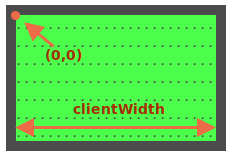

ボールは `position:absolute` を持っています。それは、その `left/top` 座標は最も近い position指定された要素、つまり `#field` から測定されることを意味します(なぜなら `#field` は `position:relative` を持っているため)。

座標は、フィールド内部の左上の角から始まります:



内部フィールドの幅/高さは `clientWidth/clientHeight` です。なので、フィールドの中央は、座標 `(clientWidth/2, clientHeight/2)` となります。

...しかし、`ball.style.left/top` をこのような値にセットした場合、ボール全体ではなく、ボールの左上の端が中心になります:

```js
ball.style.left = Math.round(field.clientWidth / 2) + 'px';
ball.style.top = Math.round(field.clientHeight / 2) + 'px';
```

次のように見えます:

[iframe height=180 src="ball-half"]

ボールの中心をフィールドの中心に揃えるために、ボールをその幅の半分だけ左に移動させ、その高さの半分だけ上に移動させる必要があります。:

```js
ball.style.left = Math.round(field.clientWidth / 2 - ball.offsetWidth / 2) + 'px';
ball.style.top = Math.round(field.clientHeight / 2 - ball.offsetHeight / 2) + 'px';
```

<<<<<<< HEAD
**注意: 落とし穴!**
=======
Now the ball is finally centered.

````warn header="Attention: the pitfall!"
>>>>>>> 69e44506c3e9dac74c282be37b55ba7ff122ae74

`` が幅/高さを持たないとき、コードは確実に動作しません:

```html

```
````

ブラウザがイメージの幅/高さを知らないとき(タグ属性またはCSSから)、イメージの読み込みが終了するまで `0` と等しいと仮定します。

<<<<<<< HEAD
実際には、最初の読み込みの後、ブラウザは通常イメージをキャッシュし、次の読み込みではすぐにサイズを取得します。

しかし、最初の読み込み時、 `ball.offsetWidth` の値は `0` です。それは間違った座標に繋がります。
=======
So the value of `ball.offsetWidth` will be `0` until the image loads. That leads to wrong coordinates in the code above.

After the first load, the browser usually caches the image, and on reloads it will have the size immediately. But on the first load the value of `ball.offsetWidth` is `0`.
>>>>>>> 69e44506c3e9dac74c282be37b55ba7ff122ae74

`` に `width/height` を追加し、それを修正する必要があります:

```html

```

...または CSS でサイズを与えます:

```css
#ball {
  width: 40px;
  height: 40px;
}
```
