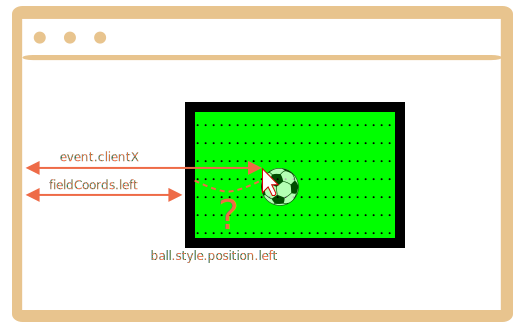

まず、ボールを配置するメソッドを選ぶ必要があります。

ページをスクロールすると、フィールドからボールを移動させるため、`position:fixed` を使うことは出来ません。

なので、`position:absolute` を使うべきであり、配置を本当に堅実にするために、`field` 自体を位置決めしてください。

次に、ボールはフィールに相対的に配置されます:

```css
#field {
  width: 200px;
  height: 150px;
  position: relative;
}

#ball {
  position: absolute;
  left: 0; /* 最も近い配置された祖先(field)への相対 */
  top: 0;
  transition: 1s all; /* ボールを飛ばずための、左/上 に対するCSS アニメーション */
}
```

<<<<<<< HEAD
次に、正しい `ball.style.position.left/top` を割り当てる必要があります。
それらはフィールドに相対的な座標を含みます。
=======
Next we need to assign the correct `ball.style.left/top`. They contain field-relative coordinates now.
>>>>>>> 468e3552884851fcef331fbdfd58096652964b5f

これはその図です:



私たちは `event.clientX/clientY` -- クリックのウィンドウに相対的な座標 -- を持っています。

クリック時のフィールドに相対的な `left` 座標を取得するには、フィールドの左端とボーダーの幅を引きます。:

```js
let left = event.clientX - fieldCoords.left - field.clientLeft;
```

<<<<<<< HEAD
通常、 `ball.style.position.left` は "要素(ボール)の左端" を意味します。なので、その `left` を割り当てると、ボールの端がマウスカーソルの下に来ることになります。
=======
Normally, `ball.style.left` means the "left edge of the element" (the ball). So if we assign that `left`, then the ball edge, not center, would be under the mouse cursor.
>>>>>>> 468e3552884851fcef331fbdfd58096652964b5f

私たちは、それを中心にするために、ボールの半分の幅を左へ、半分の高さを上へ移動させる必要があります。

なので、最終的な `left` は次のようになります:

```js
let left = event.clientX - fieldCoords.left - field.clientLeft - ball.offsetWidth/2;
```

縦の座標は同じロジックを使って計算します。

ボールの幅/高さは、`ball.offsetWidth` にアクセスしたときに知っていなければならないことに注意してください。HTMLまたはCSSで指定する必要があります。
