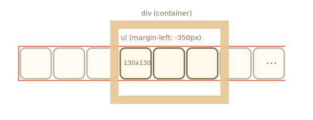

イメージのリボンは、イメージ `` の `ul/li` リストとして表現できます。

<<<<<<< HEAD
通常、このようなリボンは幅広ですが、リボンの一部のみが見えるよう、固定サイズの `
` を置いて、それを "切り取る" ようにします:
=======
Normally, such a ribbon is wide, but we put a fixed-size `
` around to "cut" it, so that only a part of the ribbon is visible:
>>>>>>> b52aa942a8e9b75ba8a65124c22593171e273bb6

リストを水平に表示するために、`display: inline-block` のような `<li>` に対して正しい CSS プロパティを適用する必要があります。

`` では、デフォルトでは `inline` なので `display` の調整も必要です。"文字の終わり" のための `inline` 要素の下に余分なスペースが確保されているので、`display:block` を使ってそれを削除します。

スクロールするために、`<ul>` をシフトします。そのための方法はたくさんありますが、例えば `margin-left` を変更するか `transform: translateX()` (より良いパフォーマンスです)を使います。:

外部の `
` は固定幅なので、"余分な" イメージはカットされます。

カルーセル全体は、ページ上で、自身で構成されている "グラフィカルコンポーネント" なので、単一の `
` でまとめ、その中でスタイルするのが良いでしょう。
