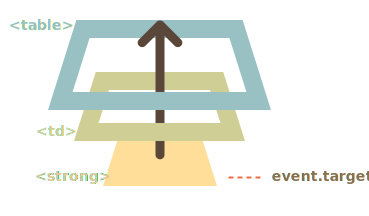

# イベント移譲(Event delegation)

<<<<<<< HEAD
キャプチャリングとバブリングにより、 *イベント移譲* と呼ばれる最も強力なイベントハンドリングのパターンの一つを実装することができます。
=======
Capturing and bubbling allow us to implement one of most powerful event handling patterns called *event delegation*.
>>>>>>> fb38a13978f6e8397005243bc13bc1a20a988e6a

この考え方は、似たような方法で多くの要素を処理する場合に、それら一つ一つにハンドラを割り当てる代わりに、共通の祖先に１つハンドラを置きます。

ハンドラでは、`event.target` を取得し、実際にどこでイベントが起きたかを見てそれを処理します。

例を見てみましょう -- 古代の中国の哲学を反映した [八卦掌図(Ba-Gua diagram)](http://en.wikipedia.org/wiki/Ba_gua) です。

これです:

[iframe height=350 src="bagua" edit link]

The HTML is like this:

```html
<table>
  <tr>
    <th colspan="3"><em>Bagua</em> Chart: Direction, Element, Color, Meaning</th>
  </tr>
  <tr>
    <td>...<strong>Northwest</strong>...</td>
    <td>...</td>
    <td>...</td>
  </tr>
  <tr>...2 more lines of this kind...</tr>
  <tr>...2 more lines of this kind...</tr>
</table>
```

テーブルは9つのセルを持っていますが、 99 でも 9999 でも関係ありません。

**我々のタスクはクリックで `<td>` セルを強調表示することです**

それぞれの `<td>` (多くなります) に `onclick` を割り当てる代わりに、`<table>` 要素で "すべてをキャッチ" するハンドラを設定します。

クリックされた要素を取得し、強調表示するために `event.target` を使います。

コードは次の通りです:

```js
let selectedTd;

*!*
table.onclick = function(event) {
  let target = event.target; // どこがクリックされた?

  if (target.tagName != 'TD') return; // TDではない？ そうなら興味ありません

  highlight(target); // 強調します
};
*/!*

function highlight(td) {
  if (selectedTd) { // あれば既存の強調表示を消します
    selectedTd.classList.remove('highlight');
  }
  selectedTd = td;
  selectedTd.classList.add('highlight'); // 新しいIDを強調表示します
}
```

このようなコードはテーブルにどれだけセルが多くても気にしません。いつでも動的に `<td>` の追加/削除が可能で、それでも強調表示は動作します。

それでも欠点があります。

クリックは `<td>` ではなく、その内側で起こる可能性があります。

我々の場合、HTML の中を見ると、`<strong>` のように、`<td>` の内側にネストされたタグが見えます。:

```html
<td>
*!*
  <strong>Northwest</strong>
*/!*
  ...
</td>
```

当然、その `<strong>` でクリックが起きた場合、それは `event.target` の値になります。



`table.onclick` ハンドラでは、このような `event.target` を取り、クリックが `<td>` の中で行われたのかそうでないのかを知る必要があります。

以下は改良したコードです:

```js
table.onclick = function(event) {
  let td = event.target.closest('td'); // (1)

  if (!td) return; // (2)

  if (!table.contains(td)) return; // (3)

  highlight(td); // (4)
};
```

説明:
1. メソッド `elem.closest(selector)` はセレクタに合致する最も近い祖先を返します。我々のケースではソース要素から上昇し `<td>` を探します。
2. もし `event.target` がどの `<td>` の内側にもない場合、その呼出は `null` を返し、何もする必要はありません。
3. ネストしたテーブルでは、`event.target` は現在のテーブルの外側にある `<td>` かもしれません。なので、実際に *テーブルの* `<td>` かどうかをチェックします。
4. もしそうであれば、強調表示します。

## 移譲サンプル: マークアップ内のアクション 

イベント移譲はイベント処理を最適化するために使うことができます。我々は多くの要素で類似のアクションに対し単一のハンドラを使います。`<td>` の強調表示で行ったように。

しかし、多くの異なるものに対する入り口としても単一のハンドラを使うことができます、

例えば、"Save" と "Load", "Search" などのボタンをもつメニューを作りたいとします。そしてメソッド `save`, `load`, `search`.... を持つオブジェクトがあります。

最初の考えは、各ボタンに別々のハンドラを割り当てる事かもしれません。しかし、よりエレガントな方法があります。私たちはメニュー全体に対してハンドラを追加し、呼び出すメソッドを持っているに対して `date-action` 属性を追加します。:

```html
<button *!*data-action="save"*/!*>Click to Save</button>
```

ハンドラは属性を読み込み、メソッドを実行します。動作例をみてください:

```html autorun height=60 run
<div id="menu">
  <button data-action="save">Save</button>
  <button data-action="load">Load</button>
  <button data-action="search">Search</button>
</div>

<script>
  class Menu {
    constructor(elem) {
      this._elem = elem;
      elem.onclick = this.onClick.bind(this); // (*)
    }

    save() {
      alert('saving');
    }

    load() {
      alert('loading');
    }

    search() {
      alert('searching');
    }

    onClick(event) {
*!*
      let action = event.target.dataset.action;
      if (action) {
        this[action]();
      }
*/!*
    };
  }

  new Menu(menu);
</script>
```

`this.onClick` は `(*)` で `this` がバインドされていることに注意してください。それは重要です。なぜなら、そうしていなければ `this` はメニューオブジェクトではなく DOM 要素を参照し、`this[action]` は我々が必要とするものではないからです。

したがって、この移譲が我々に与えれくれたものはなんでしょう？

```compare
+ 私たちはそれぞれのボタンへハンドラを割り当てるコードを書く必要はありません。単にメソッドを作り、マークアップ上にそれを置くだけです。
+ HTML 構造は柔軟で、いつでもボタンの追加/削除が可能です。
```

また、クラス `.action-save`, `.action-load` を使うこともできますが、属性 `date-action` が意味的にベターです。そして、CSS ルールの中でも使用できます。

## "振る舞い" パターン 

イベントの委譲を使用して、特別な属性やクラスを使用して、*宣言的* に要素に "振る舞い" を追加することもできます。

このパターンは2つのパートがあります:
1. 要素に特別な属性を追加します。
2. ドキュメント全体のハンドラはイベントを追跡し、属性付けされた要素でイベントが発生した場合は、そのアクションを実行します。

### Counter

<<<<<<< HEAD
例えば、ここでは属性 `data-counter` は振る舞いを追加します: ボタンをクリックすると増加します。:
=======
For instance, here the attribute `data-counter` adds a behavior: "increase value on click" to buttons:
>>>>>>> fb38a13978f6e8397005243bc13bc1a20a988e6a

```html run autorun height=60
Counter: <input type="button" value="1" data-counter>
One more counter: <input type="button" value="2" data-counter>

<script>
  document.addEventListener('click', function(event) {

    if (event.target.dataset.counter != undefined) { // もし属性が存在すれば
      event.target.value++;
    }

  });
</script>
```

もしボタンをクリックすると -- その値が増えます。ボタンではなく、ここではこの一般的なアプローチが重要です。

私たちが望むだけ、`data-counter` を持つ多くの属性があります。 私たちはいつでもHTMLに新しいものを加えることができます。 イベントの委任を使用してHTMLを "拡張" し、新しい動作を記述する属性を追加しました。

```warn header="ドキュメントレベルハンドラの場合、常に `addEventListener` です"
`document` オブジェクトにイベントハンドラを割り当てるとき、常に `addEventListener` を使用する必要があります。`document.onclick` ではありません。なぜなら、後者はコンフリクトを起こすためです: 新しいハンドラを古いものを上書きします。

実際のプロジェクトでは、コードの異なる部分で設定された `document` に多くのハンドラがあるのは普通です。
```

### Toggler

もう１つの例です。属性 `data-toggle-id` を持つ要素をクリックすると、指定された `id` の要素が表示/非表示になります。:

```html autorun run height=60
<button *!*data-toggle-id="subscribe-mail"*/!*>
  Show the subscription form
</button>

<form id="subscribe-mail" hidden>
  Your mail: <input type="email">
</form>

<script>
*!*
  document.addEventListener('click', function(event) {
    let id = event.target.dataset.toggleId;
    if (!id) return;

    let elem = document.getElementById(id);

    elem.hidden = !elem.hidden;
  });
*/!*
</script>
```

私たちがしたことをもう一度メモしましょう。要素にトグル機能を追加するには -- JavaScriptを知る必要はありません。ただ属性 `data-toggle-id` を使うだけです。

それは本当に便利になるかもしれません -- すべてのこのような要素に対してJavaScriptを書く必要はありあせん。ただその振る舞いを使うだけです。ドキュメントレベルのハンドラは、ページ上に任意の要素に対して機能します。

単一の要素上で複数の振る舞いを繋げることもできます。

"振る舞い" パターンは JavaScript の小さい破片の代替になります。

## サマリ 

イベント移譲は本当にクールです! DOM イベントに対する最も役立つパターンの１つです。

同じような多くの要素に対して同じ処理を追加するためによく使われますが、そのためだけではありません。

アルゴリズム:

1. コンテナに単一のハンドラを置きます
2. ハンドラの中で -- ソース要素 `event.target` をチェックします
3. イベントが関心のある要素の中で起きていた場合、イベントを処理します。

メリット:

```compare
+ 初期化の簡素化とメモリの節約: 多くのハンドラを追加する必要はありません。
+ コードを減らす code: 要素を追加または削除するときに、ハンドラを追加/削除する必要はありません。
+ DOM の変更: `innerHTML` などで要素を一括して追加/削除することができます
```

移譲はには、もちろん制限があります:

```compare
- まず、イベントがバブリングする必要があります。バブリングしないイベントもあります。また低レベルのハンドラは `event.stopPropagation()` を使うべきではありません。
- 2つ目に、移譲は CPU負荷を上げる可能性があります。なぜなら、コンテナレベルのハンドラは、関心があるかどうかに関わらずコンテナの任意の場所のイベントに反応するためです。しかし通常その負荷は無視できるので、考慮しません。
```
