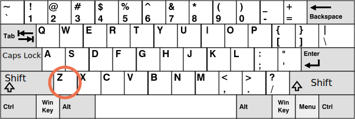

# キーボード: keydown と keyup

キーボードを学ぶ前に、現代のデバイスでは "何かを入力する" ために他の方法があることに留意してください。例えば、人々は音声認識(特にモバイルデバイスで)や、マウスによるコピーペーストを使います。
 
したがって、`<input>` フィールドへの任意の入力を追跡したい場合、キーボードイベントだけでは十分ではありません。`<input>` フィールドのどのような方法での変更も処理するために `input` と言う名前の別のイベントがあります。そしてこのようなタスクに対する良い選択である場合があります。それらに関しては、チャプター <info:events-change-input> で後ほど説明します。

キーボードイベントは、キーボードアクション(仮想キーボードも含む)を処理したいときに使われるべきです。例えば、矢印キー `key:Up` や `key:Down`、またはホットキー (キーの組み合わせを含む)に反応するために使います。


## テストスタンド [#keyboard-test-stand]

```offline
キーボードイベントをより良く理解するために、[テストスタンド](sandbox:keyboard-dump)が使えます。
```

```online
キーボードイベントをよりよく理解するために、下のテストスタンドがあります。

テキストフィールドの中で、様々なキーの組み合わせを試してみてください。

[codetabs src="keyboard-dump" height=480]
```


## Keydown と keyup 

`keydown` イベントはキーが押された時に、そして `keyup` はそれが離されたときに発生します。

### event.code と event.key

イベントオブジェクトの `key` プロパティは、イベントオブジェクトの `code` プロパティが "物理的なキーコード" を取得できる一方、文字を取得することができます。

例えば、同じキー `key:Z` が `Shift` あり / なし で押される場合があります。それは２つの異なる文字を返します: 小文字の `z` と大文字の `Z` です。

`event.key` はまさに文字であり、それは異なるでしょう。しかし、`event.code`  は同じです:


| キー          | `event.key` | `event.code` |
|--------------|-------------|--------------|
| `key:Z`      |`z` (小文字)         |`KeyZ`        |
| `key:Shift+Z`|`Z` (大文字)          |`KeyZ`        |


ユーザが異なる言語で作業する場合、別の言語に切り替えると、`"Z"` の代わりに全く違う文字になります。これは `event.key` の文字になりますが、その一方で `event.code` は常に同じ `"KeyZ"` です。

```smart header="\"KeyZ\" とその他のキーコード"
すべてのキーは、キーボード上の位置に応じたコードを持っています。キーコードは[UI イベントコード仕様](https://www.w3.org/TR/uievents-code/)で記載されています。

例えば:
- 文字キーはコード `"Key<letter>"` です: `"KeyA"`, `"KeyB"` など。
- 数字キーはコード `"Digit<number>"` です:` "Digit0"`, `"Digit1"` など。
- 特別なキーは名前でコード化されています: `"Enter"`, `"Backspace"`, `"Tab"` など。 

いくつかの広く知られているキーボードレイアウトがあり、仕様はそれぞれに対してキーコードを提供します。

より多くのコードについては [alphanumeric section of the spec](https://www.w3.org/TR/uievents-code/#key-alphanumeric-section) を見てください、もしくは上の  [テストスタンド](#keyboard-test-stand) を試してみてください。
```

```warn header="大文字小文字の問題: `\"KeyZ\"` です, `\"keyZ\"` ではありません"
明らかですが、それでも間違えることがあります。

ミスタイプを避けてください: `keyZ` ではなく `KeyZ` です。`event.code=="keyZ"` のようなチェックは機能しません: `"Key"` の最初の文字は大文字でなければなりません。
```

もし仮に、キーが文字を持たないとどうなるでしょう？例えば、`key:Shift` or `key:F1` などです。これらのキーの場合、`event.key` は `event.code` とほぼ同じです。:


| キー          | `event.key` | `event.code` |
|--------------|-------------|--------------|
| `key:F1`      |`F1`          |`F1`        |
| `key:Backspace`      |`Backspace`          |`Backspace`        |
| `key:Shift`|`Shift`          |`ShiftRight` or `ShiftLeft`        |

`event.code` は正確にどのキーが押されたかを特定することに注意してください。例えば、ほとんどのキーボードは2つの `key:Shift` キーを持っています: 左側と右側です。`event.code` は厳密にどちらが押されたのかを示し、`event.key` はキーの "意味" に対して責任を持っています: それは何か("Shift")です。

ここで、ホットキーを処理したいとしましょう: `key:Ctrl+Z` (Mac だと`key:Cmd+Z`)。多くのテキストエディタは "元に戻す" アクションをフックします。`keydown` にリスナーを設定して、どのキーが押されたか確認することができます -- ホットキーを検出するために。

ここにはジレンマがあります。:このようなリスナーにおいては、`event.key` または `event.code` どちらの値をチェックするべきでしょうか？

`event.key` の場合、値は文字であり、言語によって異なります。訪問者が OS で複数の言語をもち、切り替えた場合、同じキーで異なる文字になります。したがって、常に同じである `event.code` をチェックするのが理にかなっています。

次のようになります:

```js run
document.addEventListener('keydown', function(event) {
  if (event.code == 'KeyZ' && (event.ctrlKey || event.metaKey)) {
    alert('Undo!')
  }
});
```

その一方で、`event.code` を利用した場合の問題もあります。異なるキーボードレイアウトの場合、同じキーが異なる文字を持つ場合があります。

例えば、ここに US レイアウト ("QWERTY") とその下のドイツ語のレイアウト("QWERTZ")です(Wikipedia より)




同じキーに対して、US レイアウトは "Z" である一方、ドイツ語レイアウトは "Y" (文字が入れ替わっています)

文字通り、`key:Y` を押すと、ドイツ語のレイアウトを持つ人々の `event.code` は `KeyZ` と等しくなります。

もしコードで  `event.code == 'KeyZ'` というチェックをしている場合、ドイツ語レイアウトの人々は、`key:Y` を押すことでこの評価が通ります。

これはとても奇妙に思えますが、そのように動作します。[仕様](https://www.w3.org/TR/uievents-code/#table-key-code-alphanumeric-writing-system) でこのような振る舞いについて明示的に言及されています。

したがって、`event.code` は予期しないレイアウトの場合、間違った文字と一致する可能性があります。異なるレイアウトにおいて、同じ文字が異なる物理キーに割りあてられ、異なるコードに繋がる場合があります。幸いなことに、これはいくつかのコードでのみ起こりえます, 例: `keyA`, `keyQ`, `keyZ` (これまで見てきたように)。また、`Shift` のような特別なキーでは発生しません。[仕様](https://www.w3.org/TR/uievents-code/#table-key-code-alphanumeric-writing-system)で一覧を見ることができます。

レイアウトに依存する文字を確実に追跡するには、`event.key` のほうが適している場合があります。

一方、`event.code` は訪問者が言語を変えたとしても、物理キーにバインドされて、常に同じままであるという利点があります。したがって、これに依存するホットキーは、言語が切り替わった場合でもうまく機能します。

レイアウトに依存するキーを扱いたいたいですか？ その場合は `event.key` がよいです。

あるいは、言語を切り替えた後でもホットキーを機能させたいですか？それなら `event.code` のほうがよいかもしれません。

## 自動繰り返し 

もしキーが長時間押されていると、繰り返しを始めます: `keydown` は何度もトリガされ、その後キーが離されたとき、最終的に `keyup` を得ます。そのため、多くの `keydown` と単一の `keyup` をもつのは普通なことです。

すべての繰り返しキーに対して、イベントオブジェクトは `event.repeat` プロパティが `true` に設定されています。


## デフォルトアクション 

キーボードによって開始され得ることはたくさんあるので、デフォルトアクションさまざまです。

例えば:

- 画面に文字が現れる(もっとも明白な結果)
- 文字が削除される(`key:Delete` キー)
- ページがスクロールされる(`key:PageDown` キー)
- ブラウザが "保存" ダイアログを開く (`key:Ctrl+S`)
- などなど

`keydown` のデフォルトアクションを防ぐことは、OSベースの特別なキーを除き、それらのほとんどを取り消すことが可能です。例えば、Windows の `key:Alt+F4` は現在のブラウザウィンドウを閉じます。そして、JavaScript でデフォルトアクションを防ぐことでそれを止める方法はありません。

別の例で、下記の `<input>` は電話番号を期待しているので、数値, `+`, `()` または `-` 以外は許可しません。:

```html autorun height=60 run
<script>
function checkPhoneKey(key) {
  return (key >= '0' && key <= '9') || key == '+' || key == '(' || key == ')' || key == '-';
}
</script>
<input *!*onkeydown="return checkPhoneKey(event.key)"*/!* placeholder="Phone, please" type="tel">
```

`key:Backspace`, `key:Left`, `key:Right`, `key:Ctrl+V` のような特別なキーはインプットでは動作しないことに注意してください。これは厳密なフィルタ `checkPhoneKey` の副作用です。

少しだけ緩めましょう。:


```html autorun height=60 run
<script>
function checkPhoneKey(key) {
  return (key >= '0' && key <= '9') || key == '+' || key == '(' || key == ')' || key == '-' ||
    key == 'ArrowLeft' || key == 'ArrowRight' || key == 'Delete' || key == 'Backspace';
}
</script>
<input onkeydown="return checkPhoneKey(event.key)" placeholder="Phone, please" type="tel">
```

今は矢印や削除も動作します。

...しかし、まだマウスや右クリック+貼り付けを使用してどのような値も入力することができます。なので、フィルタは 100% 信頼はできません。ただ、殆どの場合では動作するのでこのようにすることはできます。もしくは、代わりのアプローチは `input` イベントを追跡することです -- これはすべての変更のあとにトリガされます。そこでは新しい値をチェックし、それが無効であるときには強調/変更することができます。

## レガシー 

過去、`keypress` イベントや、`keyCode`, `charCode`, `which` と言ったイベントオブジェクトのプロパティがありました。

そこにはブラウザの非互換性が非常に多く、仕様の開発者はそれらのすべてを非推奨にすることに決めました。ブラウザがそれらをサポートし続けるので、古いコードはまだ動作しますが、それらをもう使用する必要は全くありません。

このチャプターに、それらの詳しい説明があった時期もありました。しかし、今のところ、私たちはそれらを忘れても問題ありません。

## サマリ 

キーを押すと、キーに応じたキーボードイベントが常に生成されます。唯一の例外は、ノートパソコンのキーボードに表示される `key:Fn` キーです。 それはOSよりも低いレベルで実装されることが多いため、キーボードイベントはありません。

キーボードイベント:

- `keydown` -- キーを押したとき（長押しの場合は自動的に繰り返されます）
- `keyup` -- キーを離したとき

主なキーボードイベントのプロパティ:

- `code` -- "キーコード" (`"KeyA"`, `"ArrowLeft"` など)。キーボード上のキーの物理的な位置に固有です。
- `key` -- 文字 (`"A"`, `"a"` など)。非文字のキーの場合は通常 `code` と同じ値を持っています。

過去、キーボードイベントはフォームフィールドで、ユーザ入力を追跡するために使われていました。しかし、入力は様々な方法で行われる可能性があるため、それは信頼できません。任意の入力を処理するために `input` と `change` イベントがあります (これらについてはチャプター <info:events-change-input> で後ほど説明します)。これらは任意の入力後にトリガされ、マウスや音声認識なども含みます。

本当にキーボードが必要なときにキーボードイベントを使うべきです。例えば、ホットキーや特別なキーに反応するため、などです。
