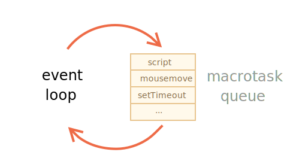
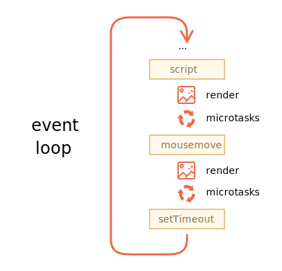

# イベントループ(event loop): microtask と macrotask

ブラウザの JavaScript 実行フローは、Node.js 同様 *event loop* に基づいています。

event loop の動作を理解することは最適化ためには重要であり、適切なアーキテクチャにとっても重要である場合があります。

このチャプターでは、最初にそれがどのように動作するかについて理論的な詳細を説明し、次にその知識の実践的な使用例を見ていきます。

## Event Loop

*event loop* のコンセプトは非常にシンプルです。無限ループで JavaScript エンジンはタスクを待機し、それらを実行し、また次のタスクを待機します。

エンジンの一般的なアルゴリズムは次の通りです:

1. タスクがある間:
    - 最も古いタスクから開始し、それらを実行します。
2. タスクが現れるまでスリープし、現れると 1. に進みます。

これは、ページを閲覧するときに見られることの形式化です。JavaScript エンジンはスクリプト/ハンドラ/イベントがアクティブになった場合にのみ実行され、ほとんどの時間何もしません。

タスクの例:

- 外部スクリプト `<script src="...">` が読み込まれるとき、"タスク" はそれを実行することです。
- ユーザがマウスを動かすとき、"タスク" は `mousemove` イベントをディスパッチし、ハンドラを実行することです。
- `setTimeout` でスケジュールされた期限がくるとき、"タスク" はそのコールバックを実行することです。
- ...等

タスクが設定され、エンジンがそれらを処理したあと、他のタスクを待機します(スリープ状態で CPU の消費はほぼゼロです)。

タスクはエンジンがビジーなときに来ることもあり、その時はキューに入れられます。

タスクはキュー、いわゆる "macrotask queue(マクロタスクキュー) (v8用語)" を形成します。 



例えば、エンジンが `script` の実行でビジーである間にユーザがマウスを移動させて `mousemove` を引き起こしたり、`setTimeout` の実行予定が来たりすると、これらのタスクは上の図に示すようにキューを形成します。

キューのタスクは "先着順" で処理されます。エンジンが `script` を完了させると、`mousemove` イベントを処理し、次に `setTimeout` ハンドラを実行していきます。

ここまではとても簡単ですね。

あと2つ詳細です:
1. エンジンがタスクを実行している間、レンダリングは発生しません。タスクが時間がかかるかどうかは関係ありません。DOM への変更はタスクが完了した後にのみ描画されます。
2. タスクに時間がかかりすぎる場合、ブラウザは他のタスクの実行やユーザイベントの処理ができないため、しばらくすると "ページが応答していません" といった警告を表示し、ページ全体のタスクを強制終了するかどうかを訪ねます。これは複雑な計算が多数ある場合や、無限ループに陥るようなプログラムミスにより引き起こされます。

ここまでは理論でした。次からこの知識をどうのように適用できるか見ていきましょう。

## ユースケース1: CPUを大量に消費するタスクの分割

大量にCPUを食うタスクがあるとしましょう。

例えば、シンタックスハイライト(このページのコード例を色付けするために使用しています)は、かなりCPU負荷がかかります。コードをハイライトするために分析を行い、多くの色付けされた要素を生成し、ドキュメントに追加します。テキスト量が多い場合には多くの時間が必要です。

エンジンがシンタックスハイライトをするのに忙しい間は、他のDOM関連の処理やユーザイベントの処理などを行うことはできません。また、ブラウザが少しの間 "一時停止" したり "ハング" する可能性もありますが、これは受け入れられません。

この問題に関しては、大きなタスクを細かく分割することで回避が可能です。最初に 100 行をハイライト処理し、次に `setTimeout` (遅延ゼロで)で次の100行を処理するようスケジュールしていきます。

このアプローチのデモについては、簡単にするためにシンタックスハイライトではなく、`1` から `1000000000` までをカウントする関数を取り上げます。

以下のコードを実行すると、エンジンはしばらく "ハング" します。サーバサイドの JS の場合は顕著です。ブラウザで実行している場合には、ページ上の他のボタンをクリックしようとしてみてください。カウントが終了するまで、他のイベントが処理されないことが確認できます。

```js run
let i = 0;

let start = Date.now();

function count() {

  // 重い処理を実行
  for (let j = 0; j < 1e9; j++) {
    i++;
  }

  alert("Done in " + (Date.now() - start) + 'ms');
}

count();
```

ブラウザは "スクリプトの実行に時間がかかっています" という警告を表示するかもしれません。

ネストされた `setTimeout` を使ってこのジョブを分割しましょう:

```js run
let i = 0;

let start = Date.now();

function count() {

  // 重い処理の一部を実行 (*)
  do {
    i++;
  } while (i % 1e6 != 0);

  if (i == 1e9) {
    alert("Done in " + (Date.now() - start) + 'ms');
  } else {
    setTimeout(count); // 新たな呼び出しをスケジュール (**)
  }

}

count();
```

これで "カウント" 処理の間もブラウザの操作は完全に機能します。

`count` を1回実行するとジョブ `(*)`の一部が実行され、必要に応じて `(**)` で再スケジュールが行われます。:

1. 最初の実行カウント: `i=1...1000000`.
2. 2回目の実行カウント: `i=1000001..2000000`.
3. ...などなど.

今、エンジンがパート1の実行でビジーな最中に新たな別のタスク(e.g. `onclick` イベント)が発生した場合、キューに入れられた後、パート1が終わったとき(次のパートが始まる前)に実行されます。`count` 実行間での event loop への定期的な戻りにより、JavaScript エンジンは他のユーザ操作に反応するための十分な "タイミング" を手にします。

注目すべき点は、両方のパターン(`setTimeout` でジョブを分割する場合とそうでない場合)の速度が同等であることです。全体をカウントする時間に大きな差はありません。

より差を近づけるために改善しましょう。

`count()` の先頭にスケジューリングの処理を移動させます:

```js run
let i = 0;

let start = Date.now();

function count() {

  // 先頭にスケジューリングを移動させる
  if (i < 1e9 - 1e6) {
    setTimeout(count); // 新たな呼び出しのスケジュール
  }

  do {
    i++;
  } while (i % 1e6 != 0);

  if (i == 1e9) {
    alert("Done in " + (Date.now() - start) + 'ms');
  }

}

count();
```

これで、`count()` を開始しさらに `count()` が必要であることが分かると、ジョブを実行する前にすぐにスケジューリングします。

実行すると、時間が大幅に短縮されることが分かります。

なぜでしょう?

簡単なことです: ご存知のように、多くのネストされた `setTimeout` 呼び出しの場合、ブラウザ内で 最小でも4msという遅延があります。たとえ `0` に設定しても `4ms` (またはそれ以上)になります。したがって、早くスケジュールするほど実行は早くなります。

これでCPUを大量に消費するタスクを分割できました。これでユーザインタフェースはブロックされません。そして全体の実行時間もそれほど長くありません。

## ユースケース2: 進行状況の表示

ブラウザスクリプトの重いタスクを分割するもう一つのメリットは進行状況を表示することができることです。

通常、ブラウザは現在のコードが完了した後にレンダリングします。タスクに時間がかかったかどうかは関係ありません。DOM への変更はタスクが終了した後にだけ行われます。

一方、これは素晴らしいことでもあります。なぜなら我々が作成した関数は多くの要素を生成したり、1つ1つドキュメントに追加したり、またそれらのスタイルを変更する可能性がありますが、訪問者がその "中間" -- 未完了状態を見ることはありません。これは重要なことです。

これはそのデモです。`i` への変更は関数が終了するまで見えません。なので、最後の値だけが見えます:


```html run
<div id="progress"></div>

<script>

  function count() {
    for (let i = 0; i < 1e6; i++) {
      i++;
      progress.innerHTML = i;
    }
  }

  count();
</script>
```

...ですが、タスクの最中にプログレスバーなど何か表示したい場合もあります。

`setTimeout` を使って重いタスクを小さな単位に分割すると、それらの間で変更が描画されます:

これはきれいに見えます:

```html run
<div id="progress"></div>

<script>
  let i = 0;

  function count() {

    // 重い処理の一部を実行 (*)
    do {
      i++;
      progress.innerHTML = i;
    } while (i % 1e3 != 0);

    if (i < 1e7) {
      setTimeout(count);
    }

  }

  count();
</script>
```

これで `<div>` にはプログレスバーのような、`i` の値の増加が表示されます。


## ユースケース3: イベントの後になにかをする

イベントハンドラの中では、イベントがバブルアップしてすべての階層で処理されるまでいくつかの処理を延期させることができます。遅延ゼロの `setTimeout` でラップすることで実現できます。

チャプター <info:dispatch-events> で見た例: カスタムイベント `menu-open` は `setTimeout` でディスパッチされるため、このイベントは "click" イベントが完全に処理された後に発生します。

```js
menu.onclick = function() {
  // ...

  // クリックされたメニュー項目のカスタムイベントを作成
  let customEvent = new CustomEvent("menu-open", {
    bubbles: true
  });

  // 非同期でカスタムイベントをディスパッチ
  setTimeout(() => menu.dispatchEvent(customEvent));
};
```

## Macrotasks と Microtasks

このチャプターで説明した *macrotasks* と併せて、チャプター <info:microtask-queue> で言及した *microtasks* が存在します。

Microtasks は通常は promise によって作成され、`.then/catch/finally` ハンドラの実行は microtask になります。Microtask は同様に promise ハンドリングの別の形の `await` の中でも使用されています。

Microtask キューで実行するために `func` をキューする `queueMicrotask(func)` という特別な関数もあります。

**すべての *macrotask* の直後に、エンジンは他の macrotask やレンダリングなどを実行する前に *microtask* キューにあるすべてのタスクを実行します。**

例えばこれを見てください:

```js run
setTimeout(() => alert("timeout"));

Promise.resolve()
  .then(() => alert("promise"));

alert("code");
```

ここでの順番はどうなるでしょう？

1. 通常の同期呼び出しである `code` が最初に表示ます。
2. `promise` が次に表示されます。なぜなら、`.then` は microtask キューを通じて、現在のコードの後に実行されるからです。
3. macrotask である `timeout` が最後に表示されます。

より詳しいイベントループは次のようになります:



**すべての microtask は他のイベントハンドリングやレンダリング、または他の macrotask が行われる前に完了します。**

これは microtask 間でアプリケーション環境が基本的には同じ(マウス座標の変更、新しいネットワークデータなどがないこと)であることを保証するため重要なことです。

(現在のコードの後に)関数を非同期に実行したいが、変更がレンダリングされたり新しいイベントが処理される前がよい場合は、`queueMicrotask` でスケジューリングすることができます。

ここに以前に示したものと類似の "カウントするプログレスバー" の例がありますが、`setTimeout` の代わりに `queueMicrotask` が使用されています。ここでは同期コードのように、レンダリングが最後に行われていることがわかります:

```html run
<div id="progress"></div>

<script>
  let i = 0;

  function count() {

    // 重い処理の一部を実行 (*)
    do {
      i++;
      progress.innerHTML = i;
    } while (i % 1e3 != 0);

    if (i < 1e6) {
  *!*
      queueMicrotask(count);
  */!*
    }

  }

  count();
</script>
```

## サマリ

イベントループのより詳細なアルゴリズム([仕様](https://html.spec.whatwg.org/multipage/webappapis.html#event-loop-processing-model)と比べると簡素化されていますが):

1. *macrotask* キューにある最も古いタスク(e.g "スクリプト")を取り出して実行します。
2. すべての *microtask* を実行します。
    - microtask キューが空でない間
        - 最も古い microtask を取り出して実行します。
3. 変更がある場合はレンダリングします。
4. macrotask キューが空であれば、macrotask が現れるまで待ちます。
5. ステップ1 に戻ります。

新しい *macrotask* をスケジュールするには:
- 遅延ゼロの `setTimeout(f)` を使用します。

これは、ブラウザがユーザーイベントに反応したり、タスクの進捗状況を表示することができるよう、計算量の多いタスクを小さく分割するために使用されます。

また、イベントが完全に処理された(バブリングが完了した)後にアクションを行うようスケジュールするために、イベントハンドラ内でも使われることがあります。

新しい *microtask* をスケジュールするには:
- `queueMicrotask(f)` を使用します。
- また、promise ハンドラは microtask キューで処理されます。

microtask 間では UI やネットワークイベントの処理はありません: これらはすぐに次々と実行されます。

```smart header="Web Workers"
イベントループをブロックしてはならない長く重い計算に対しては、[Web Workers](https://html.spec.whatwg.org/multipage/workers.html) を利用することができます。

これは並列スレッドでコードを実行する方法です。

Web Worker はメインプロセスとメッセージを交換することができますが、独自の変数とイベントループを持ちます。

Web Worker は DOM にはアクセスできないので、主に計算のために複数のCPUコアを同時に使用するのに役立ちます。
```
