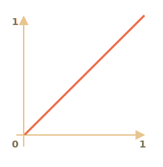
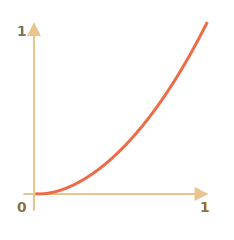
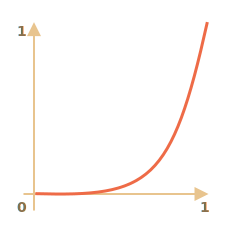
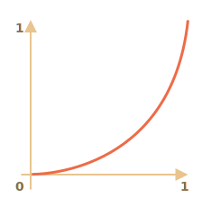
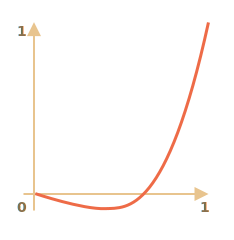
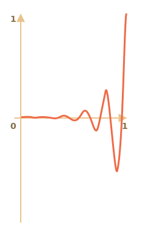
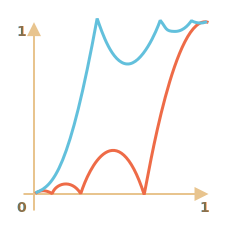

# JavaScript アニメーション

JavaScript アニメーションは CSS ではできないことを扱うことができます。

例えば、ベジェ曲線とは異なるタイミング関数を用いて複雑な経路に沿って移動したり、canvas 上でのアニメーションなどです。

[cut]

## setInterval

HTML/CSS の観点からは、アニメーションはスタイルプロパティの段階的な変更です。例えば、`style.left` を `0px` から `100px` に変更すると、要素が移動します。

そして、もしそれを `setInterval` の中で増加させるとき、毎秒 50 回の小さな変更を加えることによって、その変化はなめらかに見えます。これは映画館と同じ原理です。: 毎秒 24 以上のフレームがあれば十分に滑らかに見えます。

疑似コードは次のようになります:

```js
let delay = 1000 / 50; // 1 秒で 50 フレーム
let timer = setInterval(function() {
  if (animation complete) clearInterval(timer);
  else increase style.left
}, delay)
```

より複雑なアニメーションの例:

```js
let start = Date.now(); // 開始時間を覚える

let timer = setInterval(function() {
  // 開始からの経過時間は？
  let timePassed = Date.now() - start;

  if (timePassed >= 2000) {
    clearInterval(timer); // 2秒後にアニメーションが終了
    return;
  }

  // timePassed 時点のアニメーションを描画
  draw(timePassed);

}, 20);

// timePassed は 0 から 2000 まで進む
// なので、left は 0px から 400px になります
function draw(timePassed) {
  train.style.left = timePassed / 5 + 'px';
}
```

デモです。電車をクリックしてみてください:

[codetabs height=200 src="move"]

## requestAnimationFrame

複数のアニメーションが同時に実行されているとしましょう。

もしそれらを別々に実行し、それぞれが個別に `setInterval(..., 20)` を持っていると、ブラウザは `20ms` 間隔よりもっと頻繁に再描画をする必要があります。

各 `setInterval` は `20ms` 毎に一回トリガしますが、独立しているので `20ms` の中に複数の独立した実行があることになります。

これらの複数の独立した再描画は、ブラウザの再描画を簡単にし、CPUの負荷を減らしてよりなめらかに見せるためにグループ化すべきです。

言い換えると、次のコード:

```js
setInterval(function() {
  animate1();
  animate2();
  animate3();
}, 20)
```

...は以下のコードよりも軽量です:

```js
setInterval(animate1, 20);
setInterval(animate2, 20);
setInterval(animate3, 20);
```

心に留めておくべきことがもう一つあります。CPUが過負荷になっている場合や、その他再描画をあまりしなくて良い場合があります(ブラウザタブが非表示になっているようなとき）。そのため、本当は20ms毎に実行すべきではありません。

しかし、それを JavaScript ではどうやってしるのでしょう？ 関数 `requestAnimationFrame` を提供する標準の [アニメーションタイミング](http://www.w3.org/TR/animation-timing/) があります。この関数は、これらすべての問題及び、その他多くのことに対応しています。

構文:
```js
let requestId = requestAnimationFrame(callback)
```

これは、ブラウザがアニメーションをしたい最も近い時間に `callback` 関数を実行するようスケジューリングします。

もし `callback` の中で要素を変更すると、他の `requestAnimationFrame` コールバックや CSS アニメーションと一緒にグループ化されます。これにより、配置の再計算と再描画がそれぞれではなく1回でまとめて行われます。

返却値 `requestId` は呼び出しをキャンセルするのに使うことができます:
```js
// スケジューリングされたコールバックの実行をキャンセルする
cancelAnimationFrame(requestId);
```

`callback` は1つの引数を取ります -- ページロードの開始からの経過時間のマイクロ秒です。
この時間は [performance.now()](mdn:api/Performance/now) を呼び出すことでも得ることができます。

通常 `callback` は CPU が過負荷状態になったり、ノートPCのバッテリーがほとんどなかったり、その他別の理由がある場合を除きすぐに実行されます。

下のコードは `requestAnimationFrame` での最初の10回の実行時間を表示します。通常は 10-20ms です。

```html run height=40 refresh
<script>
  let prev = performance.now();
  let times = 0;

  requestAnimationFrame(function measure(time) {
    document.body.insertAdjacentHTML("beforeEnd", Math.floor(time - prev) + " ");
    prev = time;

    if (times++ < 10) requestAnimationFrame(measure);
  })
</script>
```

## Structured animation

これで、`requestAnimationFrame` に基づいた、様々な状況に対応することのできるアニメーション関数を作成することができます。

```js
function animate({timing, draw, duration}) {

  let start = performance.now();

  requestAnimationFrame(function animate(time) {
    // timeFraction は 0 から 1 になります
    let timeFraction = (time - start) / duration;
    if (timeFraction > 1) timeFraction = 1;

    // 現在のアニメーションの状態を計算します
    let progress = timing(timeFraction)

    draw(progress); // 描画します

    if (timeFraction < 1) {
      requestAnimationFrame(animate);
    }

  });
}
```

関数 `animate` はアニメーションを記述するための3つのパラメータを受け付けます。:

`duration`
: アニメーションのトータルの時間。例: `1000`。

`timing(timeFraction)`
: 経過時間(開始時: `0`, 終了時: `1`)を基に、アニメーションの完了(ベジェ曲線の `y` のような) を返す、CSS プロパティ `transition-timing-function` のようなタイミング関数です。

    例えば、線形関数はアニメーションが同じスピードで均一に進むことを意味します。:

    ```js
    function linear(timeFraction) {
      return timeFraction;
    }
    ```

    グラフはこのようになります:
    

    これは `transition-timing-function: linear` のようなものです。下にあるようなより興味深いケースがあります。

`draw(progress)`
: アニメーションの完了状態を取り、描画を行う関数です。値 `progress=0` はアニメーションの開始状態を示し、`progress=1` は終了状態を示します。

    これは実際にアニメーションを描画する関数です。

    要素が移動します:
    ```js
    function draw(progress) {
      train.style.left = progress + 'px';
    }
    ```
    
    ...または、他のことを行うことで、どんな方法でも何でもアニメーションさせることができます。

この関数を使って、要素の `width` を `0` から `100%` までアニメーションさせてみましょう。

デモ内の要素をクリックしてください:

[codetabs height=60 src="width"]

コードは次の通りです:

```js
animate({
  duration: 1000,
  timing(timeFraction) {
    return timeFraction;
  },
  draw(progress) {
    elem.style.width = progress * 100 + '%';
  }
});
```

CSS アニメーションとは異なり、任意のタイミング関数や描画関数を作ることができます。タイミング関数はベジェ曲線には制限されません。そして `draw` はプロパティを超えて、花火のアニメーションといった新しい要素を作成することもできます。

## タイミング関数

上記で最もシンプルな線形のタイミング関数を見ました。

他のものも見てみましょう。様々なタイミング関数でのアニメーションを試して、どのように動くのかを確認してみます。

### Power of n(n のべき乗)

アニメーションをスピードアップさせたい場合には、`n` のべき乗で `progress` を使います。 

例えば、放物曲線:

```js
function quad(timeFraction) {
  return Math.pow(timeFraction, 2)
}
```

グラフ:



動作を見る（クリックして有効化）:

[iframe height=40 src="quad" link]

...または、3次曲線のような `n` がより大きい場合。`n` を増やすことでより速度が上がります。

これは、べき乗 `5` での `progress` のグラフです。:



動作を見る:

[iframe height=40 src="quint" link]

### 円弧

関数:

```js
function circ(timeFraction) {
  return 1 - Math.sin(Math.acos(timeFraction));
}
```

グラフ:



[iframe height=40 src="circ" link]

### 戻る: 弓

この関数は "弓の射撃" を行います。最初に "弦を引き"、次に "撃ちます"。

前の関数とは異なり、追加のパラメータ `x`, "弾性係数" に依存します。"弦を引く" 距離はこれにより定義されます。

コード:

```js
function back(x, timeFraction) {
  return Math.pow(timeFraction, 2) * ((x + 1) * timeFraction - x)
}
```

**`x = 1.5` の場合のグラフ:**



アニメーションの場合、特定の `x` の値で使用します。これは `x = 1.5` の例です:

[iframe height=40 src="back" link]

### バウンド

ボールを落としたと想像してください。それは落ちて後何度か跳ね返ってから停止します。

`bounce` 関数はそれと同じことをしますが、始まる順序は逆です。なお、このために必要な特別な係数はほとんどありません。:

```js
function bounce(timeFraction) {
  for (let a = 0, b = 1, result; 1; a += b, b /= 2) {
    if (timeFraction >= (7 - 4 * a) / 11) {
      return -Math.pow((11 - 6 * a - 11 * timeFraction) / 4, 2) + Math.pow(b, 2)
    }
  }
}
```

動作を見る:

[iframe height=40 src="bounce" link]

### 弾性のあるアニメーション

"初期範囲" 用の追加パラメータ `x` を受け取るもう一つの "弾む" 関数です。

```js
function elastic(x, timeFraction) {
  return Math.pow(2, 10 * (timeFraction - 1)) * Math.cos(20 * Math.PI * x / 3 * timeFraction)
}
```

**`x=1.5` のグラフです:**


`x=1.5` の場合の動作:

[iframe height=40 src="elastic" link]

## Reversal: ease*

ここまでで様々なタイミング関数があります。これらは "easeIn" と呼ばれます。

アニメーションを逆の順序で表示する必要があることがあります。これは、"easeOut" 変換で行います。

### easeOut

"easeOut" モードでは、`timing` 関数はラッパー `timingEaseOut` の中に配置されます。

```js
timingEaseOut(timeFraction) = 1 - timing(1 - timeFraction)
```

つまり、"通常の" タイミング関数を取り、"そのラッパーを返す" "変換" 関数 `makeEaseOut` を使用します。:

```js
// タイミング関数を引数とし、変換したものを返す
function makeEaseOut(timing) {
  return function(timeFraction) {
    return 1 - timing(1 - timeFraction);
  }
}
```

例えば、上述の `bounce` 関数に対して適用してみます:

```js
let bounceEaseOut = makeEaseOut(bounce);
```

すると、最初ではなくアニメーションの最後にバウンドするようになります。より自然にみえます。:

[codetabs src="bounce-easeout"]

ここでは、変換関数がどのように元の関数の挙動を変化させたのかが確認できます:



跳ね返るような、アニメーションが最初にある場合には、それは最後似表示されます。

上のグラフでは <span style="color:#EE6B47">通常のバウンド</span>  は赤色、<span style="color:#62C0DC">easeOut のバウンド</span> は青色です。

- 通常のバウンド: 物体は下の方で跳ね、最後に急激に跳ね上がります。
- `easeOut` : 最初に上に大きく跳ねてからバウンドします

### easeInOut

アニメーションの最初と最後両方でこの効果を見せることもできます。このトランジションは "easeInOut" と呼ばれます。

タイミング関数が与えられると、次のようにアニメーションの状態を算出します:

```js
if (timeFraction <= 0.5) { // アニメーションの前半
  return timing(2 * timeFraction) / 2;
} else { // アニメーションの後半
  return (2 - timing(2 * (1 - timeFraction))) / 2;
}
```

このラッパーコードです:

```js
function makeEaseInOut(timing) {
  return function(timeFraction) {
    if (timeFraction < .5)
      return timing(2 * timeFraction) / 2;
    else
      return (2 - timing(2 * (1 - timeFraction))) / 2;
  }
}

bounceEaseInOut = makeEaseInOut(bounce);
```

`bounceEaseInOut` の動作を見る:

[codetabs src="bounce-easeinout"]

"easeInOut" 変換は2つのグラフを1つにします: アニメーションの前半用の `easeIn` と、後半用の `easeOut` (`easeIn` の反転)です。

円弧 `circ` タイミング関数を例にして、その `easeIn`, `easeOut` と `easeInOut` のグラフを比べると、その効果ががはっきりと分かります。:


- <span style="color:#EE6B47">赤</span> 通常の `circ` (`easeIn`).
- <span style="color:#8DB173">緑</span> -- `easeOut`.
- <span style="color:#62C0DC">青</span> -- `easeInOut`.

ご覧の通り、アニメーションの前半のグラフは縮小された `easeIn` であり、後半は縮小された `easeOut` のグラフです。結果、アニメーションはそれぞれの効果ではじまり、そして終わります。

## より興味深い "draw"

要素を移動させる代わりに、他のことをすることもできます。必要なことは適切な `draw` を記述することです。

これは "バウンド" するテキスト入力のアニメーション例です:

[codetabs src="text"]

## サマリ

CSS では上手く扱えなかったり、厳密な制御が必要なアニメーションの場合、JavaScript が役立ちます。JavaScript アニメーションは `requestAnimationFrame` 経由で実装します。この組み込みのメソッドにより、ブラウザが再描画を準備するときに実行されるコールバック関数をセットアップすることができます。通常、それはすぐですが、正確な時間はブラウザに依存します。

また、これはページがバックグラウンドのときは再描画はまったく行いません。コールバックが実行されないからです。アニメーションは一時停止し、リソースも消費されません。これは素晴らしいことです。

これは、ほとんどのアニメーションのセットアップに使えるヘルパー関数 `animate` です:

```js
function animate({timing, draw, duration}) {

  let start = performance.now();

  requestAnimationFrame(function animate(time) {
    // timeFraction は 0 tから 1
    let timeFraction = (time - start) / duration;
    if (timeFraction > 1) timeFraction = 1;

    // 現在のアニメーションの状態を計算
    let progress = timing(timeFraction);

    draw(progress); // 描画

    if (timeFraction < 1) {
      requestAnimationFrame(animate);
    }

  });
}
```

オプション:

- `duration` -- アニメーションの合計時間(ms)。
- `timing` -- アニメーションの進行状況を計算する関数。0 〜 1 まで値を引数に取り、通常は 0 〜 1 でアニメーションの進行状況を返します。
- `draw` -- アニメーションを描画する関数です。

もちろん、これを改善して様々なオプションを追加することができますが、JavaScript アニメーションは日常的に使用されるものではありません。これらはなにか興味深いことをする場合や非標準的なことをする際に利用されます。そのため、必要なときに必要な機能を追加するのがよいでしょう。

JavaScript アニメーションは、任意のタイミング関数を扱うことができます。ここでは多くの例を取り上げました。CSS とは異なり、JavaScript アニメーションはベジェ曲線に制限されません。

`draw` についても同様です。CSS プロパティだけでなく、何でもアニメーションにすることができます。