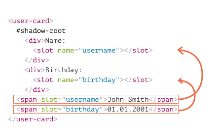

# Shadow DOM スロット, コンポジション

タブ、メニュー、イメージギャラリーなど多くのコンポーネントはレンダリングするのにコンテンツを必要とします。

組み込みのブラウザの `<select>` が `<option>` 項目を期待するように、独自に作った `<custom-tabs>` も実際のタブコンテンツが渡されることを期待することがあります。

`<custom-menu>` を使用するコードは次のようになります:

```html
<custom-menu>
  <title>Candy menu</title>
  <item>Lollipop</item>
  <item>Fruit Toast</item>
  <item>Cup Cake</item>
</custom-menu>
```

...そして、このコンポーネントはタイトルとアイテムを持つメニューとして表示され、かつメニューイベントを処理するなど適切にレンダリングできる必要ががあります。

どうやって実装するのでしょう？

要素の内容を分析し、DOM ノードを動的にコピー/再配置することもできます。ただ、可能ではありますが要素を shadow DOM に移動している場合、ドキュメントの CSS スタイルは適用されないため視覚的なスタイルが失われる可能性があります。また、ある程度コーディングが必要になります。

幸いなことに、このようなことをする必要はありません。Shadow DOM は `<slot>` 要素をサポートしています。これは Light DOM のコンテンツを自動的に挿入してくれます。

## 名前付きスロット

簡単な例で slot(スロット)がどのように動くか確認しましょう。

ここにある `<user-card>` Shadow DOM は Light DOM で埋められる2つのスロットを提供します。:

```html run autorun="no-epub" untrusted height=80
<script>
customElements.define('user-card', class extends HTMLElement {
  connectedCallback() {
    this.attachShadow({mode: 'open'});
    this.shadowRoot.innerHTML = `
      <div>Name:
*!*
        <slot name="username"></slot>
*/!*
      </div>
      <div>Birthday:
*!*
        <slot name="birthday"></slot>
*/!*
      </div>
    `;
  }
});
</script>

<user-card>
  <span *!*slot="username"*/!*>John Smith</span>
  <span *!*slot="birthday"*/!*>01.01.2001</span>
</user-card>
```

Shadow DOM では、`<slot name="X">` で "挿入位置" (`slot="X"` を持つ要素がレンダリングされる場所)を定義します。

次に、ブラウザは "コンポジション(composition)" を実行します: Light DOM から要素を取得し、Shadow DOM の対応するスロットにレンダリングしていきます。最後にデータが挿入されたコンポーネントになります。

これはスクリプト後の DOM 構造です。コンポジションは考慮されていません。:

```html
<user-card>
  #shadow-root
    <div>Name:
      <slot name="username"></slot>
    </div>
    <div>Birthday:
      <slot name="birthday"></slot>
    </div>
  <span slot="username">John Smith</span>
  <span slot="birthday">01.01.2001</span>
</user-card>
```

Shadow DOM を作成したので、`#shadow-root` の下にそれがあります。今、要素には Light DOM と Shadow DOM 両方があります。

レンダリングするために、Shadow DOM 内の各 `<slot name="...">` に対して、ブラウザは Light DOM に同じ名前をもつ `slot="..."` を探します。これらの要素がスロット内でレンダリングされます。:



結果は "flattened" DOM(フラット化された DOM ツリー)と呼ばれます:

```html
<user-card>
  #shadow-root
    <div>Name:
      <slot name="username">
        <!-- スロット対象の要素はスロット内に挿入されます -->
        <span slot="username">John Smith</span>
      </slot>
    </div>
    <div>Birthday:
      <slot name="birthday">
        <span slot="birthday">01.01.2001</span>
      </slot>
    </div>
</user-card>
```

...ですが、フラット化された DOM はレンダリングとイベント処理の目的でのみ存在します。これは一種の "仮想" であり、どのように見えるかを示していますが、ドキュメント内のノードは実際には移動していません!

`querySelector` を実行することで簡単に確認ができます: ノードは依然として同じ場所にあります。

```js
// `<user-card>` の下にある light DOM <span> ノードはまだ同じ場所にいます
alert( document.querySelector('user-card span').length ); // 2
```

したがって、フラット化された DOM はスロットを挿入することで Shadow DOM から派生しています。ブラウザはそれをレンダリングし、スタイルの継承やイベントの伝搬(詳細は後ほど)に使用します。ですが、JavaScript は依然としてフラット化する前のドキュメント "そのまま" を見ています。

````warn header="最上位の子だけが slot=\"...\" 属性を持つことができます"
`slot="..."` 属性はシャドウホスト(上の例で言うと `<user-card>` 要素)の直接の子に対してのみ有効です。ネストされた要素に対しては無視されます。

例えば、ここでは2つ目の `<span>` は無視されます(`<user-card>` の最上位の子ではないため):
```html
<user-card>
  <span slot="username">John Smith</span>
  <div>
    <!-- 無効なスロット, user-card の直接の子である必要があります -->
    <span slot="birthday">01.01.2001</span>
  </div>
</user-card>
```
````

Light DOM に同じスロット名を持つ複数の要素がある場合、それらは順々にスロットに追加されます。

例えばこの場合:
```html
<user-card>
  <span slot="username">John</span>
  <span slot="username">Smith</span>
</user-card>
```

`<slot name="username">` に2つの要素を持つフラット化された DOM になります:

```html
<user-card>
  #shadow-root
    <div>Name:
      <slot name="username">
        <span slot="username">John</span>
        <span slot="username">Smith</span>
      </slot>
    </div>
    <div>Birthday:
      <slot name="birthday"></slot>
    </div>
</user-card>
```

## スロット フォールバックコンテンツ

`<slot>` の中に何かを置くと、それがフォールバックとなり、"デフォルト" のコンテンツになります。ブラウザは Light DOM に対応するものがない場合これを表示します。

例えば、この Shadow DOM では、Light DOM に `slot="username"` がなければ、`Anonymous` をレンダリングします。

```html
<div>Name:
  <slot name="username">Anonymous</slot>
</div>
```

## デフォルトスロット: 最初の名前のないスロット

Shadow DOM 内の、名前を持たない最初の `<slot>` が "デフォルト" スロットです。Light DOM でどこにもスロットされていなすべてのノードを取得します。

例えば、ユーザに関するすべてのスロットなし情報を表示するデフォルトスロットを `<user-card>` に追加しましょう:

```html run autorun="no-epub" untrusted height=140
<script>
customElements.define('user-card', class extends HTMLElement {
  connectedCallback() {
    this.attachShadow({mode: 'open'});
    this.shadowRoot.innerHTML = `
    <div>Name:
      <slot name="username"></slot>
    </div>
    <div>Birthday:
      <slot name="birthday"></slot>
    </div>
    <fieldset>
      <legend>Other information</legend>
*!*
      <slot></slot>
*/!*
    </fieldset>
    `;
  }
});
</script>

<user-card>
*!*
  <div>I like to swim.</div>
*/!*
  <span slot="username">John Smith</span>
  <span slot="birthday">01.01.2001</span>
*!*
  <div>...And play volleyball too!</div>
*/!*
</user-card>
```

すべてのスロットなしの Light DOM のコンテンツは "Other information" のフィールドセットに入ります。

要素はスロットに次々に追加されるので、スロットなしの情報は両方ともデフォルトスロットになります。

フラット化された DOM はこのようになります:

```html
<user-card>
  #shadow-root
    <div>Name:
      <slot name="username">
        <span slot="username">John Smith</span>
      </slot>
    </div>
    <div>Birthday:
      <slot name="birthday">
        <span slot="birthday">01.01.2001</span>
      </slot>
    </div>
    <fieldset>
      <legend>About me</legend>
*!*
      <slot>
        <div>I like to swim.</div>
        <div>...And play volleyball too!</div>
      </slot>
*/!*
    </fieldset>
</user-card>
```

## メニュー例

ではこのチャプターの冒頭で言及した `<custom-menu>` に戻りましょう。

要素を配置するのにスロットが使えます。

これは `<custom-menu>` のマークアップです:

```html
<custom-menu>
  <span slot="title">Candy menu</span>
  <li slot="item">Lollipop</li>
  <li slot="item">Fruit Toast</li>
  <li slot="item">Cup Cake</li>
</custom-menu>
```

これは適切なスロットを持つ Shadow DOM テンプレートです:

```html
<template id="tmpl">
  <style> /* menu styles */ </style>
  <div class="menu">
    <slot name="title"></slot>
    <ul><slot name="item"></slot></ul>
  </div>
</template>
```

1. `<span slot="title">` は `<slot name="title">` に入ります。
2. 複数の `<li slot="item">` がありますが、テンプレートには `<slot name="item">` が1つだけです。そのため、すべての `<li slot="item">` は `<slot name="item">` に順に追加され、リストを形成します。

フラット化された DOM は次のようになります:

```html
<custom-menu>
  #shadow-root
    <style> /* menu styles */ </style>
    <div class="menu">
      <slot name="title">
        <span slot="title">Candy menu</span>
      </slot>
      <ul>
        <slot name="item">
          <li slot="item">Lollipop</li>
          <li slot="item">Fruit Toast</li>
          <li slot="item">Cup Cake</li>
        </slot>
      </ul>
    </div>
</custom-menu>
```

1点、お気づきかもしれませんが、有効な DOM では `<li>` は `<ul>` の直接の子でなければなりません。ですが、これはフラット化された DOM でありコンポーネントがどのようにレンダリングされたかを説明しています。ここではこのようなことは自然と起こります。

一覧のオープン/クローズのための `click` ハンドラの追加が必要です。これで `<custom-menu>` は準備できました:

```js
customElements.define('custom-menu', class extends HTMLElement {
  connectedCallback() {
    this.attachShadow({mode: 'open'});

    // tmpl は shadow DOM テンプレートです (上記)
    this.shadowRoot.append( tmpl.content.cloneNode(true) );

    // light DOM ノードを選択することはできないので、スロット上のクリックを処理しましょう
    this.shadowRoot.querySelector('slot[name="title"]').onclick = () => {
      // メニューのオープン/クローズ
      this.shadowRoot.querySelector('.menu').classList.toggle('closed');
    };
  }
});
```

これは完全なデモです:

[iframe src="menu" height=140 edit]

もちろん、ここからさらに機能を追加することが可能です: イベントやメソッドなど。

## スロットの更新

外部のコードが動的にメニュー項目を追加/削除したい場合はどのようになるでしょうか？

**ブラウザはスロットを監視し、スロット要素が追加/削除されるとレンダリングを更新します。**

また、light DOM ノードはコピーではなく、単にスロットにレンダリングされるだけなので、その内部での変更はすぐに見えます。

したがって、レンダリングを更新するために必要なことはありません。ですが、コンポーネントのコードがスロットの変更を知りたい場合には `slotchange` イベントが利用できます。

例えば、ここでは1秒後メニュー項目が挿入され、2秒後にタイトルが変わります。:

```html run untrusted height=80
<custom-menu id="menu">
  <span slot="title">Candy menu</span>
</custom-menu>

<script>
customElements.define('custom-menu', class extends HTMLElement {
  connectedCallback() {
    this.attachShadow({mode: 'open'});
    this.shadowRoot.innerHTML = `<div class="menu">
      <slot name="title"></slot>
      <ul><slot name="item"></slot></ul>
    </div>`;

    // shadowRoot はイベントハンドラを持たないため、最初の子を利用します
    this.shadowRoot.firstElementChild.addEventListener('slotchange',
      e => alert("slotchange: " + e.target.name)
    );
  }
});

setTimeout(() => {
  menu.insertAdjacentHTML('beforeEnd', '<li slot="item">Lollipop</li>')
}, 1000);

setTimeout(() => {
  menu.querySelector('[slot="title"]').innerHTML = "New menu";
}, 2000);
</script>
```

メニューのレンダリングは我々の介入なしで毎回更新されます。

ここでは 2つの `slotchange` イベントがあります:

1. 初期化:

    light DOM からの `slot="title"` が対応するスロットに入ると、`slotchange: title` が直ちにトリガーされます。
2. １秒後:

    `<li slot="item">` が追加されたときに `slotchange: item` がトリーがされます。

注意してください: 2秒後に `slot="title"` の中身が変更されたとき `slotchange` イベントは発生しません。これはスロットの変更がないためです。スロット要素内のコンテンツを変更していますが、それば別のことです。

JavaScript で light DOM の内部の変更を追跡したい場合は、より一般的な仕組みを利用することで可能です: [MutationObserver](info:mutation-observer).

## Slot API

最後に、スロットに関連する JavaScript メソッドに触れましょう。

以前見たように、JavaScript はフラット化することなく "実際の DOM" を見ます。ですが、shadow ツリーが `{mode: 'open'}` の場合、どの要素がスロットに割り当てられているか、また逆にどのスロットに要素が割り当てられているのかを把握することができます。:

- `node.assignedSlot` -- `node` が割り当てられている `<slot>` 要素を返します。
- `slot.assignedNodes({flatten: true/false})` -- スロットへ割り当てられている DOM ノードを返します。`flatten` オプションはデフォルトは `false` です。明示的に `true` に設定した場合、フラット化された DOM をより深く調べ、ネストされたコンポーネントの場合はネストされたスロットを返し、ノードが割り当てられていない場合にはフォールバックコンテンツを返します。
- `slot.assignedElements({flatten: true/false})` -- スロットへ割り当てられている DOM 要素を返します。(要素ノードに対して上記と同じ動作をします)。

これらのメソッドは、単にスロットコンテンツを表示するだけではなく、JavaScript でそれを追跡する必要があるときに役立ちます。

例えば、`<custom-menu>` コンポーネントが表示内容を知りたい場合、`slotchange` を追跡し、そこで `slot.assignedElements` をすることで項目を取得することができます:

```html run untrusted height=120
<custom-menu id="menu">
  <span slot="title">Candy menu</span>
  <li slot="item">Lollipop</li>
  <li slot="item">Fruit Toast</li>
</custom-menu>

<script>
customElements.define('custom-menu', class extends HTMLElement {
  items = []

  connectedCallback() {
    this.attachShadow({mode: 'open'});
    this.shadowRoot.innerHTML = `<div class="menu">
      <slot name="title"></slot>
      <ul><slot name="item"></slot></ul>
    </div>`;

    // slottable is added/removed/replaced
*!*
    this.shadowRoot.firstElementChild.addEventListener('slotchange', e => {
      let slot = e.target;
      if (slot.name == 'item') {
        this.items = slot.assignedElements().map(elem => elem.textContent);
        alert("Items: " + this.items);
      }
    });
*/!*
  }
});

// items を1秒後に更新します
setTimeout(() => {
  menu.insertAdjacentHTML('beforeEnd', '<li slot="item">Cup Cake</li>')
}, 1000);
</script>
```


## サマリ

通常、要素に shadow DOM がある場合、その light DOM は表示されません。スロットを使用することで、 shadow DOM の特定の位置に light DOM の要素を表示することができます。

２種類のスロットがあります:

- 名前付きスロット: `<slot name="X">...</slot>` は `slot="X"` を持つ light DOM の子を取得します。
- デフォルトスロット: 名前なしの最初の `<slot>` (後続の名前のないスロットは無視されます)はスロットのない light の子を取得します。
- 同じスロットに対して複数の要素がある場合、それらは順に追加されます。
- `<slot>` 要素のコンテンツはフォールバックとして使用されます。そのスロットに対応する light の子がない場合に表示されます。

スロット内のスロットされた要素をレンダリングするプロセスは "コンポジション(composition)" と呼ばれます。結果は　”フラット化された DOM (flattened DOM)” と呼ばれます。

コンポジションは実際にはノードは移動させておらず、JavaScript から見ると DOM は依然として同じままです。

JavaScript は次のメソッドを使用してスロットにアクセスすることができます:
- `slot.assignedNodes/Elements()` -- `slot` 内のノード/要素をを返します。
- `node.assignedSlot` -- 上とは逆でノードによりスロットを返します。

表示されているものが知りたい場合、次を利用してスロットのコンテンツを追跡することができます:
- `slotchange` イベント -- スロットが最初に埋められたとき、およびスロット要素に対する追加/削除/置換操作でトリガーされます。が、その子ではありません。 スロットは `event.target` です。
- [MutationObserver](info:mutation-observer) スロットのコンテンツをより深く調べて、その中の変更を監視します。

これで shadow DOM で light DOM の要素を表示する方法がわかったので、それらを適切にスタイルする方法を見てみましょう。基本的なルールは、shadow 要素は内側で、light 要素は -- 外側でスタイルされますが、例外があります。

詳細については、次のチャプターで説明します。
